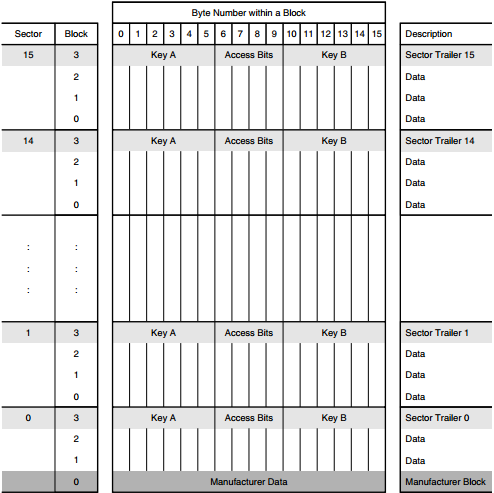
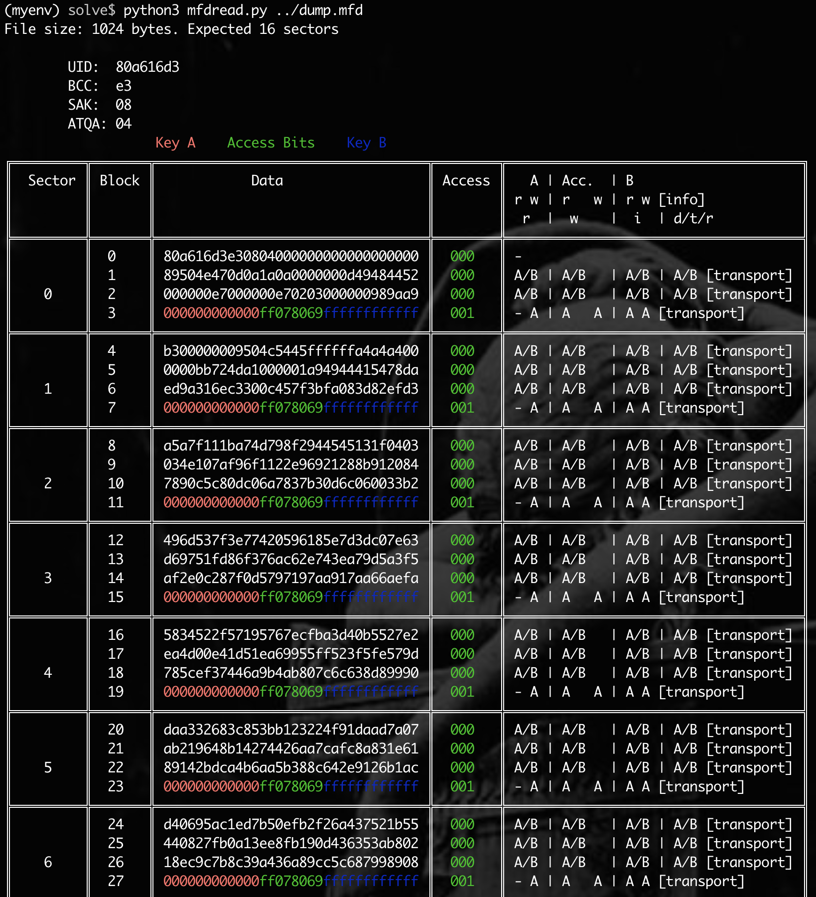
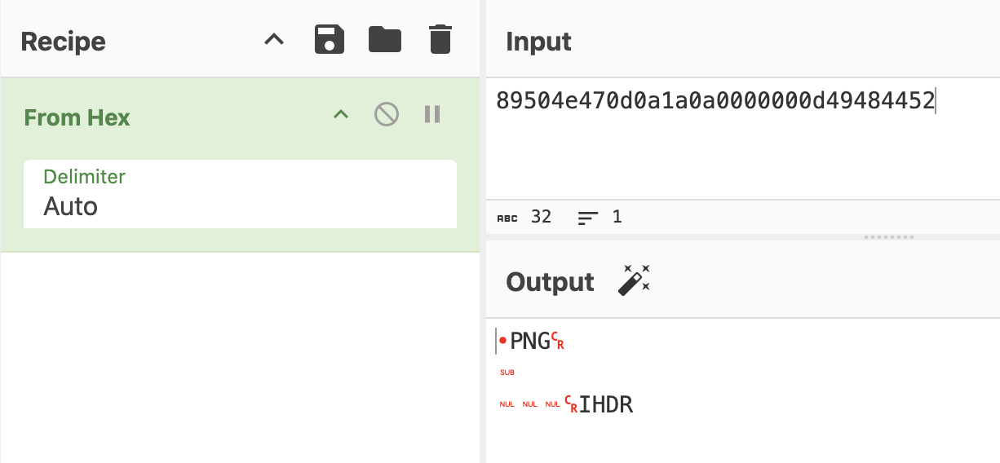
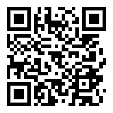
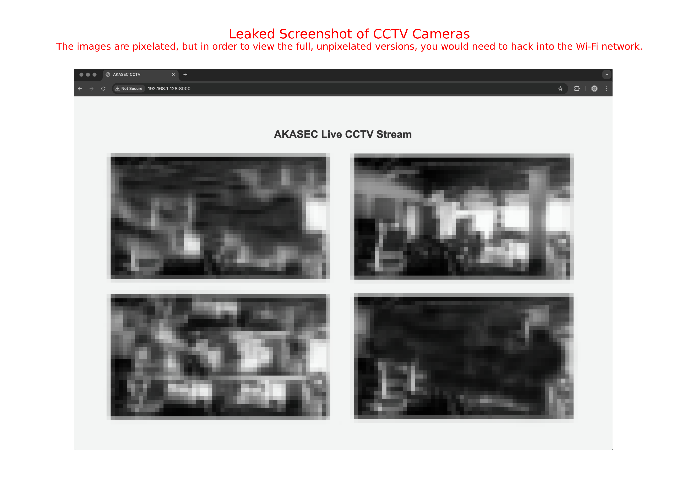
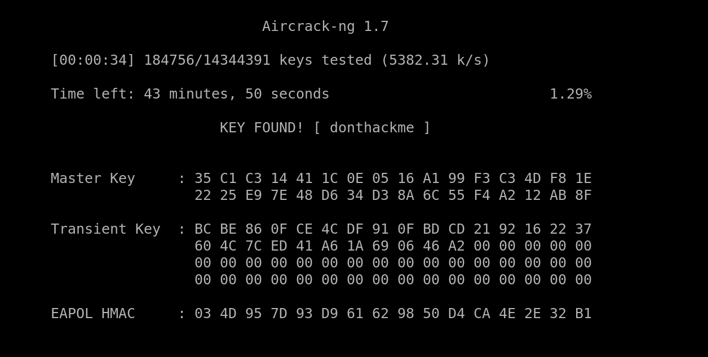
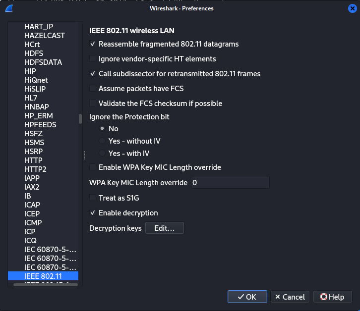
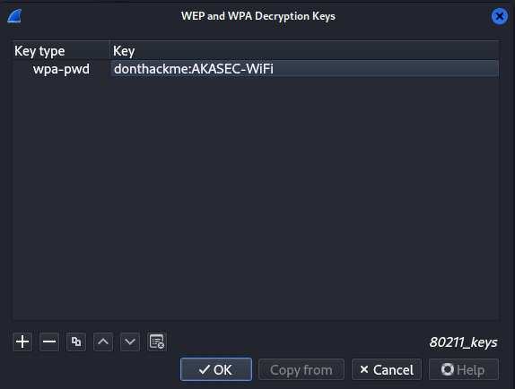
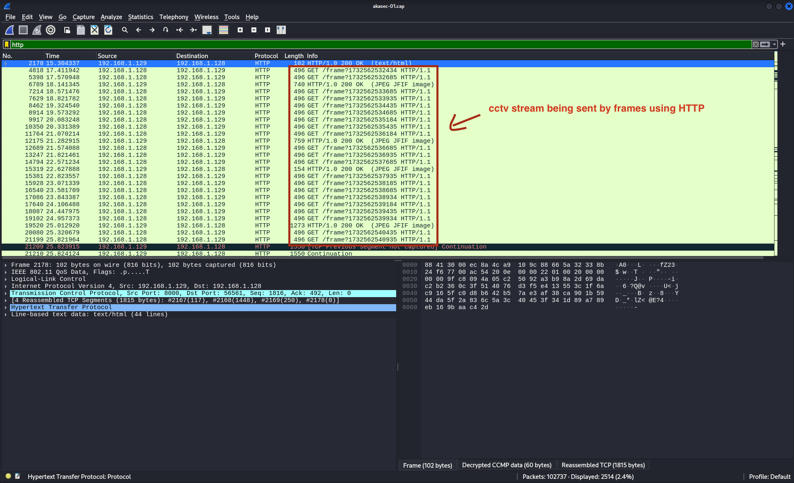
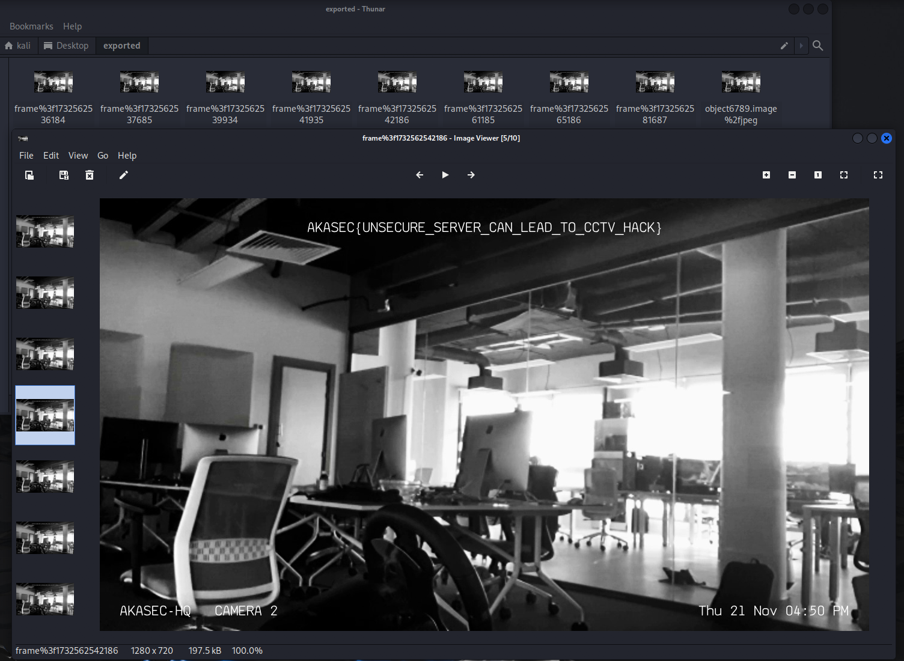

#### Warning: The following scenario is entirely fictional and part of a Hardware/IoT security CTF (Capture The Flag) challenge. Any references to individuals, organizations, or events, including the character "Youssra" attempting to hack a club named "Akasec Club," are purely hypothetical and created for educational purposes. This scenario is designed to simulate a security challenge and is not meant to encourage or condone illegal activities. The goal of this challenge is to enhance skills in ethical hacking, security research, and system protection. Hacking, unauthorized access to systems, and other cybercrimes are illegal and unethical. Always respect the law and act responsibly online.

## The Scenario :

Youssra, a cybersecurity enthusiast, wants to test the security of the Akasec Club at her school. The club's infrastructure is vulnerable, as they've made several security mistakes. Your task is to assist Youssra in gathering as much data as possible so she can report the vulnerabilities to the club and further enhance her hacking skills.V

## First Task : Get the Hidden Data in the MIFARE CLASSIC 1K KEY


The first activity in this scenario involves the person finding a Mifare Classic 1K key, which is used to access the club room. Using her robotics and hacking skills, she successfully dumps the key data and asks you to analyze it and determine what's inside.

### Solution :

We are provided with a dump file (dump.mfd) of the MIFARE key. The dump contains a lot of gibberish data, so we need to parse it into human-readable format in order to continue our analysis.

To parse the file, you can use the script provided by (@zhovner) https://github.com/zhovner/mfdread, or you can create your own script. However, in both cases, you'll need to understand the memory layout of the MIFARE Classic 1K.



The MIFARE Classic 1K card holds 1024 bytes, which are divided into 16 sectors. Each sector is further divided into 4 blocks. Blocks 0, 1, and 2 of each sector contain data, while block 3 holds the keys and access control bits (controlling access to the stored data on the card and ensuring its security). Additionally, the first block (Block 0) of the first sector (Sector 0) contains the manufacturer data, such as the UID and other related information.

This is a screenshot of the dump file being parsed using (@zhovner)'s script.



Now that we know where the data is stored, if we examine the second block of the first sector (sector 0, block 1), we find a PNG file signature. This indicates that the key stores a PNG image, which we need to extract.



Using a custom script, we can extract the stored image.

```py
# Usage: python3 script.py <dump file>

import sys

def extract_and_save(file_path):
    with open(file_path, 'rb') as f:
        file_bytes = f.read()
    hex_data = file_bytes.hex()
    all_data = ""
    for i, chunk_start in enumerate(range(0, len(hex_data), 32)):
        if i == 0 or (i + 1) % 4 == 0: # this is for skipping the first block in first sector and the 4th block in each sector
            continue
        all_data += hex_data[chunk_start:chunk_start + 32]
    byte_data = bytes.fromhex(all_data)
    with open('flag.png', 'wb') as f:
        f.write(byte_data)
    print("done, saved to flag.png")

file_path = sys.argv[1]
extract_and_save(file_path)
```

We can then obtain an image, which is a QR code that reveals the flag when scanned.



FLAG : `AKASEC{h1dd3n_1n_m1f4r3_card}`

The vulnerability here is that the data is stored in plain text without encryption. Sensitive data should always be encrypted to protect it from unauthorized access. Additionally, any sensitive operations, such as checking or verifying user information, should be done server-side, where stronger security measures can be implemented.

## Second Task : Crack the Wifi Password and retrieve the CCTV footage.



In this activity, based on the leaked screenshot our little hacker iscovered that the club had security cameras that could be monitored via their Wi-Fi network, but viewing the dashboard required authentication. Using her hacking skills, she successfully captured wireless packets from the club wifi (AKASEC-WiFi), including the Wi-Fi handshake, by performing a deauthentication attack, along with other network packets. Your task is to assist her in cracking the Wi-Fi password and retrieving the CCTV footage from the captured packets.

### Solution :

The provided .cap file contains a Wi-Fi handshake. But what exactly is a Wi-Fi handshake?

When a device attempts to connect to a Wi-Fi network, it goes through a process known as the 4-way handshake. This is a sequence of messages exchanged between the device (client) and the Wi-Fi router (access point). The purpose of the handshake is to authenticate the device on the network and to negotiate encryption keys that secure communication between the device and the router.

In this case, the hacker used a deauthentication attack, which forces a device to disconnect from the Wi-Fi network by sending fake deauthentication packets. This disrupts the connection, allowing the attacker to capture the Wi-Fi handshake, as seen in our scenario. Deauthentication attacks can also be used for denial-of-service (DoS) attacks.

Now, we have a capture file from the club's Wi-Fi network (AKASEC-WiFi). Let's proceed by cracking the handshake and retrieving the Wi-Fi password.


We will use aircrack-ng, a tool that includes several utilities for assessing Wi-Fi network security, with the ability to crack WEP and WPA PSK passwords. We will provide it with a wordlist to check passwords against; in this case, we'll use the famous wordlist, Rockyou.txt

```shell
aircrack-ng akasec-01.cap -w ./rockyou.txt
```

In less than a minute, we can obtain the Wi-Fi password, which is `donthackme`.



Now that we have the password, let's decrypt the traffic using the SSID and password.
Open the .cap file in Wireshark and go to Edit → Preferences → Protocols → IEEE 802.11




Check the Enable Decryption box. If it's not already checked, click Edit next to Decryption Keys. Then, click the + button to add a decryption key.
Select wpa-pwd for the Key Type, and enter the key in the following format: `password:SSID`.

In our case, set it to `donthackme:AKASEC-WiFi`.



Now that we've decrypted the traffic on the AKASEC network, go to the Wireshark filter bar and filter by HTTP, which contains unencrypted traffic. You will see many GET requests that fetch image frames from the CCTV cameras.



To export all the images from the HTTP protocol Go to File → Export Objects → HTTP select all the image files you want to save, Choose a destination folder and click Save to export the images.



FLAG : `AKASEC{UNSECURE_SERVER_CAN_LEAD_TO_CCTV_HACK}`

The main vulnerability in this scenario is the importance of using a strong password for your Wi-Fi network. If your Wi-Fi is connected to sensitive devices, such as CCTV cameras, attackers could potentially access these devices—even if the camera's dashboard has authentication in place. This is because, if an attacker gains access to your network, they may be able to bypass other security measures. Additionally, many security cameras still use the outdated HTTP protocol to send video streams, which is insecure because it does not encrypt the data. This makes it possible for attackers to intercept the video feed and gain access to potentially sensitive footage.