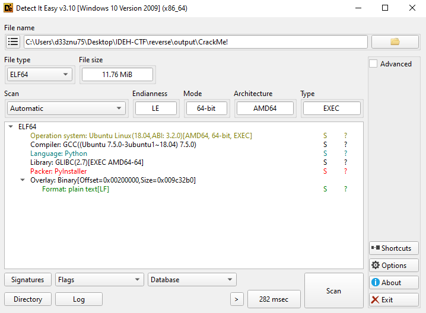
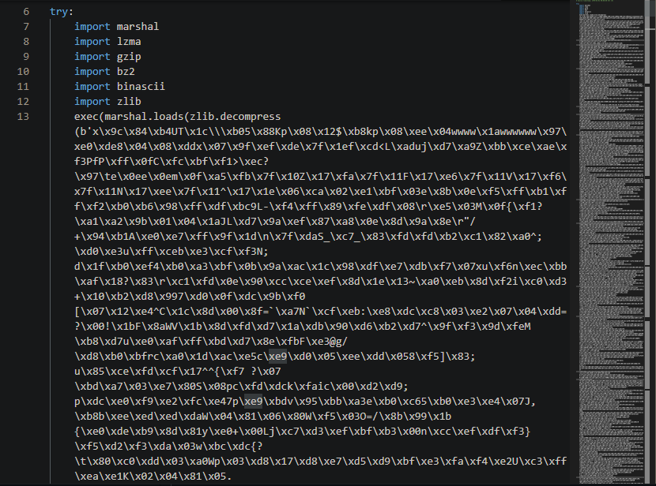
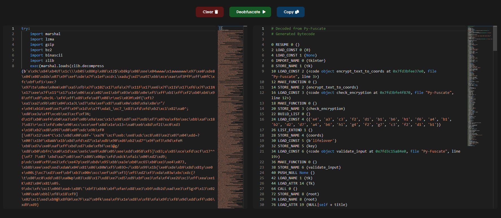
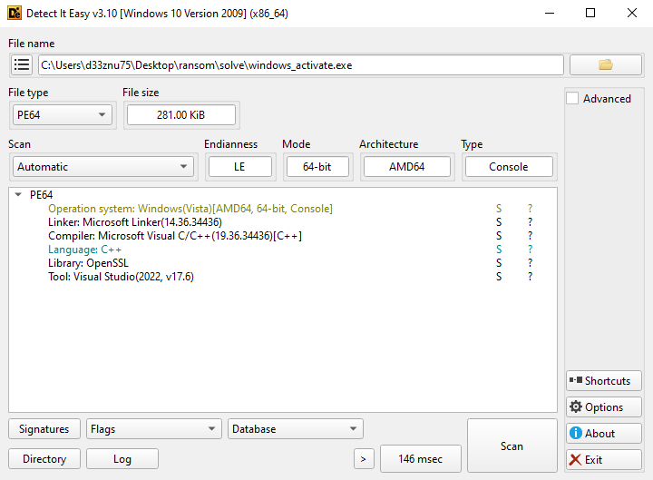
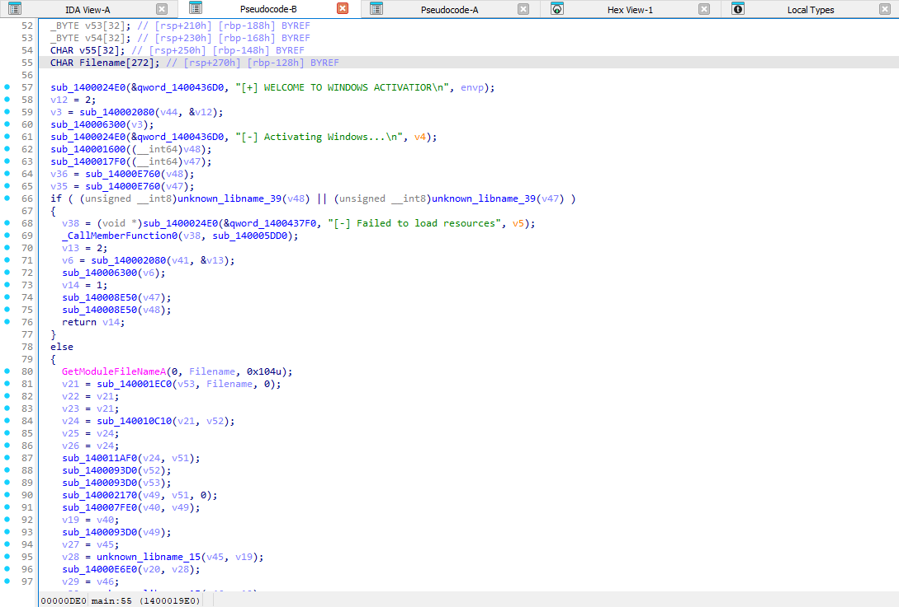
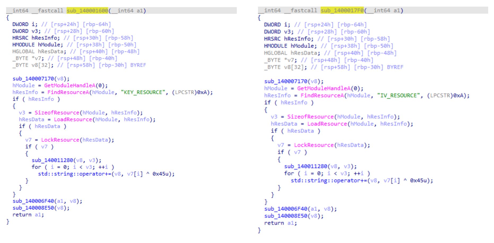
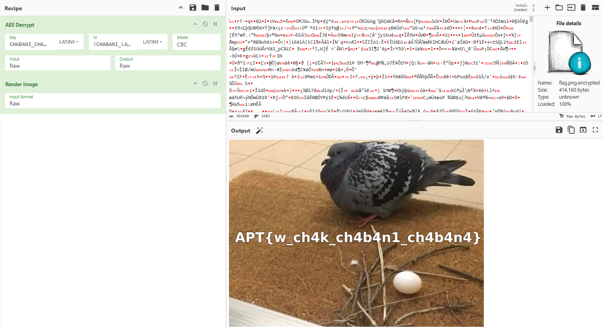

# CrackMe!

In this challenge, participants were given a binary file. Upon execution, it presents a simple GUI with a text input box and a "Check" button — essentially a flag checker. The goal is to reverse-engineer the binary and recover the correct input that will produce the flag.


### Step 1: Initial Binary Analysis

We begin by using the file command to inspect the binary:

```
$ file CrackMe!
CrackMe!: ELF 64-bit LSB executable, x86-64, version 1 (SYSV), dynamically linked, interpreter /lib64/ld-linux-x86-64.so.2, for GNU/Linux 3.2.0, BuildID[sha1]=fc89f558d158bb1cc6e5e463d6fe7c536da15abb, stripped
```

So it’s a 64-bit ELF binary, dynamically linked, and stripped (no symbols).

Next, we want to determine if it's packed and what language it was originally written in.

### Step 2: Identifying the Language and Packer

We use Detect It Easy (DIE) to analyze the binary:



DIE tells us this is a Python application bundled with PyInstaller. PyInstaller packages Python applications into standalone executables, embedding the Python interpreter and required libraries.

### Step 3: Extracting the PyInstaller Archive

To decompile the executable, we use `pyinstxtractor.py` — a Python script that extracts PyInstaller-packed binaries.

```
$ python3 pyinstxtractor.py CrackMe!

[+] Processing CrackMe!
[+] Pyinstaller version: 2.1+
[+] Python version: 3.12
[+] Length of package: 12277682 bytes
[+] Found 365 files in CArchive
[+] Beginning extraction...please standby
[+] Possible entry point: pyiboot01_bootstrap.pyc
[+] Possible entry point: pyi_rth__tkinter.pyc
[+] Possible entry point: pyi_rth_inspect.pyc
[+] Possible entry point: check.pyc
[+] Found 104 files in PYZ archive
[+] Successfully extracted pyinstaller archive: CrackMe!

```

Among the extracted files, we find our entry point: `check.pyc`

### Step 4: Decompiling the Obfuscated Python Code

We decompile check.pyc using `pylingual` and discover it’s obfuscated:



The obfuscation was done using Py-Fuscate — a tool that compresses and marshals Python bytecode.

To reverse it, you can manually:

- Decompress with zlib

- Unmarshal the code with marshal

- Repeat the process if the next layer is also obfuscated or uses a different compression method

This can become a time-consuming and repetitive task because multiple layers of obfuscation are used.

Or save time and use my online deobfuscator tool [pydeobf.xyz](https://pydeobf.xyz) or use the [Python Deobfuscator for Py-Fuscate](https://github.com/d33znu75/PyFuscate_deobfscator) on my GitHub, which deobfuscates Py-Fuscate code and outputs the raw bytecode. Why bytecode? because the marshal module works at the bytecode level, not the source level.

Deobfuscated bytecode using my online tool:



### Step 5: Deobfuscation to Source Code

Once we extract the bytecode, we can either:

- Manually reverse it (takes a lot of time), or

- Let an LLM (like ChatGPT) regenerate the readable Python code from bytecode.


Here’s the recovered source code:

```py
import tkinter as tk

def encrypt_text_to_coords(text, key):
    encrypted = [ord(b) ^ ord(key[i % len(key)]) for i, b in enumerate(text.encode())]
    coords = []
    for byte in encrypted:
        rank = byte // 8 + 1
        file = 'abcdefgh'[byte % 8]
        coords.append(f"{file}{rank}")
    return coords

def check_encryption(input_text, coords, key):
    encrypted_coords = encrypt_text_to_coords(input_text, key)
    return encrypted_coords == coords

coords = [
    'e4', 'a3', 'c3', 'f2', 'd1', 'b1', 'b6', 'h1',
    'f6', 'a4', 'b1', 'b2', 'd2', 'd7', 'a4', 'b6',
    'h1', 'g4', 'f2', 'g7', 'c3', 'f2', 'd1', 'b1'
]

key = b"lifelover"

def validate_input():
    user_input = entry.get()
    if check_encryption(user_input, coords, key):
        result_label.config(
            text=f"Correct! here is your flag: APT{{{user_input}}}",
            fg="green"
        )
    else:
        result_label.config(text="Incorrect! ghiyerha", fg="red")

# GUI setup
root = tk.Tk()
root.title("Crack me!")
label = tk.Label(root, text="Enter the secret:", font=("Courier", 14))
label.pack(pady=10)
entry = tk.Entry(root, font=("Courier", 14), width=30)
entry.pack(pady=10)
validate_button = tk.Button(
    root,
    text="Check",
    font=("Courier", 14),
    command=validate_input
)
validate_button.pack(pady=10)
result_label = tk.Label(root, text="", font=("Courier", 14))
result_label.pack(pady=10)
root.mainloop()
```

### Step 6: Reverse Engineering the Algorithm

The encryption function XORs the input string with a repeating key `lifelover`, then maps each result byte to a chessboard-style coordinate using:

```
Rank = (byte // 8) + 1
File = 'abcdefgh'[byte % 8]
```

To reverse it:

- Convert each coordinate back into its byte representation.

- XOR with the key.

- Decode into a UTF-8 string.

Example :
```
e4 → file e → index 4, rank 4 → (4-1)*8 + 4 = 28
```

### Step 7: Solver Script

Here's a solver python code that will give us the correct secret : 

```py
def coords_to_encrypted_bytes(coords):
    files = 'abcdefgh'
    encrypted = []
    for coord in coords:
        file_char = coord[0]
        rank = int(coord[1])
        file_index = files.index(file_char)
        byte = (rank - 1) * 8 + file_index
        encrypted.append(byte)
    return encrypted

def decrypt_coords(encrypted_bytes, key):
    return bytes([b ^ key[i % len(key)] for i, b in enumerate(encrypted_bytes)])

coords = [
    'e4', 'a3', 'c3', 'f2', 'd1', 'b1', 'b6', 'h1',
    'f6', 'a4', 'b1', 'b2', 'd2', 'd7', 'a4', 'b6',
    'h1', 'g4', 'f2', 'g7', 'c3', 'f2', 'd1', 'b1'
]
key = b"lifelover"

encrypted = coords_to_encrypted_bytes(coords)
secret = decrypt_coords(encrypted, key).decode()
print(secret)
```

Output : `python_b_thon_w_bla_thon`


FLAG : `APT{python_b_thon_w_bla_thon}`

# ransomware

In this challenge, participants were given a Windows executable ransomware and an encrypted flag file. Their objective was to reverse engineer the binary and its encryption method to recover the original file.

### Static Analysis

First, I performed static analysis using DIE (Detect It Easy):



The analysis revealed a 64-bit console executable compiled in C++ using Visual Studio 2022. It also uses OpenSSL, which likely handles the file encryption functionality.

### Decompilation

I used IDA to decompile the binary. Examining the main function revealed:



The execution flow is:

 1 - The binary prints "[+] WELCOME TO WINDOWS ACTIVATIOR"

 2 - It calls `sub_140006300` with an argument (time calculations suggest this is a sleep function, confirmed by sandbox execution showing a delay between messages)

 3 - It prints " "[-] Activating Windows..."

 4 - It calls two important functions: `sub_140001600` and `sub_1400017F0`

Looking deeper at these two functions:



Both functions:

- Load binary resources named "IV_RESOURCE" and "KEY_RESOURCE"

- XOR-decrypt them with the byte 0x45 (decimal 69)

- Append the result to a std::string

This indicates the ransomware uses hardcoded XOR-obfuscated encryption keys stored in the .rsrc section.

### Resource Analysis

To extract these resources, I used Resource Hacker to examine the .rsrc section:


After obtaining the XOR-encrypted KEY and IV values, I performed XOR decryption:


#### KEY : `CHABANI_CHABANA!`


#### IV : `!CHABANI_LABANI!`

### Decryption

With the key and initialization vector identified, I determined that the ransomware likely uses AES encryption. I attempted decryption with these values:



FLAG: `APT{w_ch4k_ch4b4n1_ch4b4n4}`

