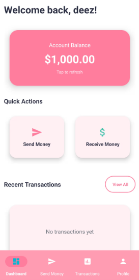
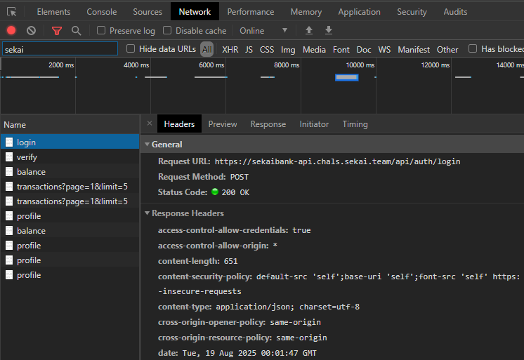
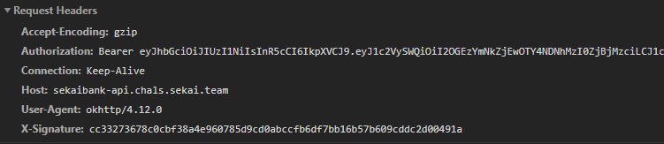
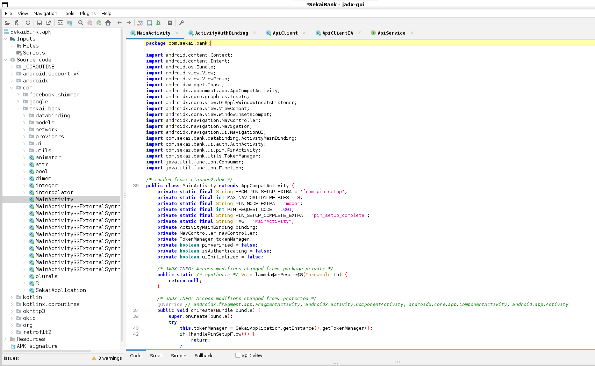
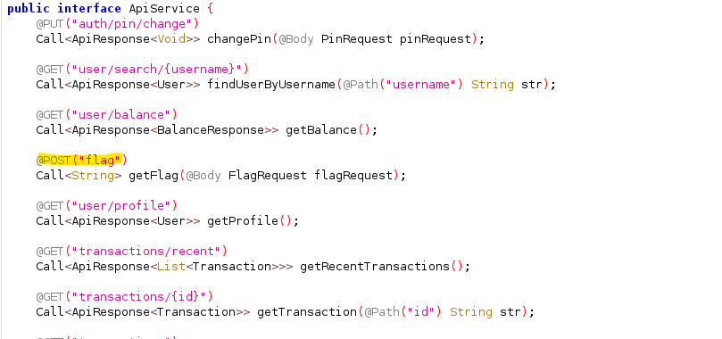
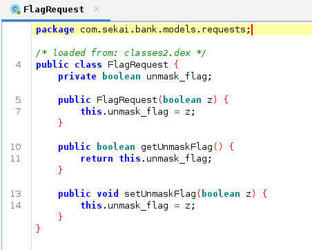
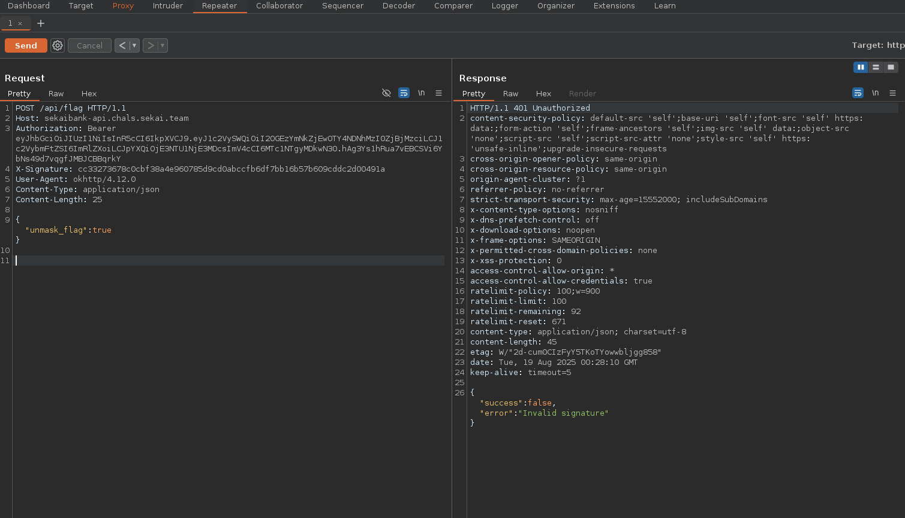
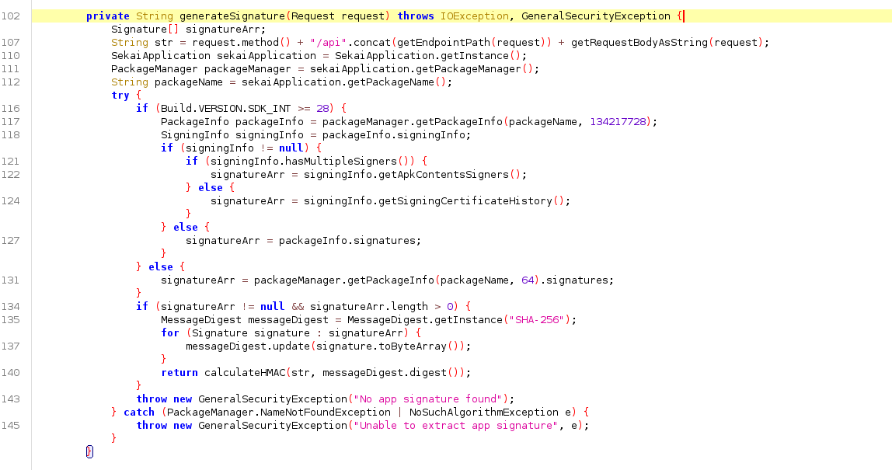
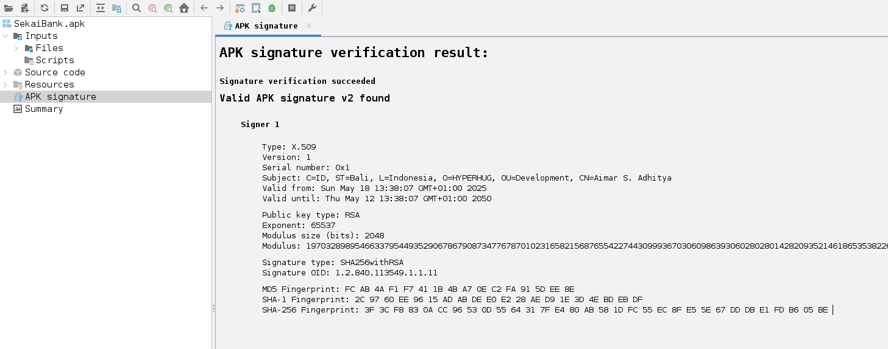
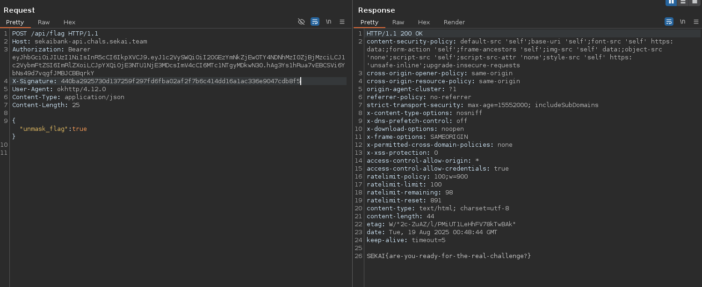

## Introduction

This write-up covers an APK reverse-engineering challenge from SekaiCTF 2025. The goal was to understand how the app signs API requests and to reproduce the signature generation so we could call the protected `/api/flag` endpoint and retrieve the flag.

## Initial analysis

After installing the app, I found a login screen requiring a username and password, with a registration option.


After registering, the app asks to set a PIN, then opens the main dashboard. The account starts with a $1,000 balance and has send/receive functionality.



I enabled network logging to inspect the requests the app makes and observed calls to the API at:

```
https://sekaibank-api.chals.sekai.team/api/
```



The requests include an Authorization header (a JWT) and an `X-Signature` header.



## Decompilation

I used jadx to decompile the APK and explored the app's package structure. The main activity is in `com.sekai.bank`.



The networking code is under `com.sekai.bank.network`. I found an endpoint used to fetch the flag and the request model used for it.




The flag endpoint accepts a POST to `/api/flag` with a JSON body that matches the `FlagRequest` model. The body contains a boolean `unmask_flag`, so sending `{"unmask_flag": true}` should request the unmasked flag.

I attempted the request from Burp Suite, but the server rejected it with an "invalid signature" error.



## Finding the signature algorithm

In `com.sekai.bank.network` there is a `SignatureInterceptor` class which adds the `X-Signature` header. The `generateSignature` method constructs a string from the HTTP method, endpoint path, and body, then uses the app's signing certificate as the HMAC key.



Concretely, the flow is:
- Build the string: METHOD + "/api" + endpoint_path + body
- Obtain the app's signing certificate fingerprint (SHA-256)
- Use the certificate bytes as the HMAC key and compute HMAC-SHA256 over the string

The app's SHA-256 signing-fingerprint (extracted from the APK) was:

```
SHA-256 Fingerprint: 3F 3C F8 83 0A CC 96 53 0D 55 64 31 7F E4 80 AB 58 1D FC 55 EC 8F E5 5E 67 DD DB E1 FD B6 05 BE
```

In Jadx you can find the Signature certificate in APK folder



## Reproducing the signature

To call `/api/flag` we must reproduce the same signature the app generates. The important details are:

- HTTP method: POST
- Endpoint path (used in the signed string): `/flag` (the interceptor prepends `/api` when building the signed string)
- Body: `{"unmask_flag": true}` (compact JSON, no extra whitespace)

Below is a Python script that reproduces the signing process and performs the request. It uses the SHA-256 fingerprint as the HMAC key (binary form).

```python
import hmac
import hashlib
import json
import binascii

hex_fingerprint = "3F3CF8830ACC96530D5564317FE480AB581DFC55EC8FE55E67DDDBE1FDB605BE"
key_bytes = binascii.unhexlify(hex_fingerprint)

method = "POST"
endpoint_path = "/flag"
body_dict = {"unmask_flag": True}
body = json.dumps(body_dict, separators=(",", ":"))
data_to_sign = method + "/api" + endpoint_path + body

signature = hmac.new(key_bytes, data_to_sign.encode("utf-8"), hashlib.sha256).hexdigest() # compute HMAC-SHA256 signatu>signature = signature.lower()

print(f"X-Signature: {signature}")
```

Output:

```
X-Signature: 440ba2925730d137259f297fd6fba02af2f7b6c414dd16a1ac336e9047cdb8f5
```

Now lets use this signature in our API request to `/api/flag` using Burp Suite.



And voilà! we have successfully got the flag:

```
SEKAI{are-you-ready-for-the-real-challenge?}
```

Here is a Python script to automate the API request:

```python
import hmac
import hashlib
import binascii
import json
import requests

hex_fingerprint = "3F3CF8830ACC96530D5564317FE480AB581DFC55EC8FE55E67DDDBE1FDB605BE" 
key_bytes = binascii.unhexlify(hex_fingerprint)

method = "POST"
endpoint_path = "/flag"
body_dict = {"unmask_flag": True}
body = json.dumps(body_dict, separators=(",", ":"))
data_to_sign = method + "/api" + endpoint_path + body

signature = hmac.new(key_bytes, data_to_sign.encode("utf-8"), hashlib.sha256).hexdigest()
signature = signature.lower()

url = "https://sekaibank-api.chals.sekai.team/api/flag"
bearer_token = "<REDACTED_BEARER_TOKEN>"  # replace with a real token obtained 
headers = {
    "Authorization": f"Bearer {bearer_token}",
    "X-Signature": signature,
    "Content-Type": "application/json",
}

response = requests.post(url, headers=headers, data=body)
print(response.text)
```

Happy reversing!

