## Challenge Description

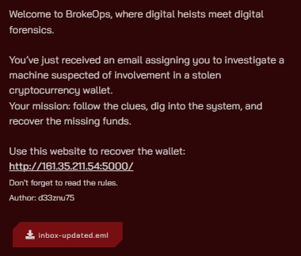

In this challenge, I provide participants with an EML file, which is an email file format. We can open it with any text editor or email client.

Additionally, I gave a link to a website that mimics a MetaMask wallet recovery service by inputting the seed phrase.

> **Note:** The website is for testing the recovered seed phrase only; it doesn't store any data. It returns the flag if the seed phrase is correct.

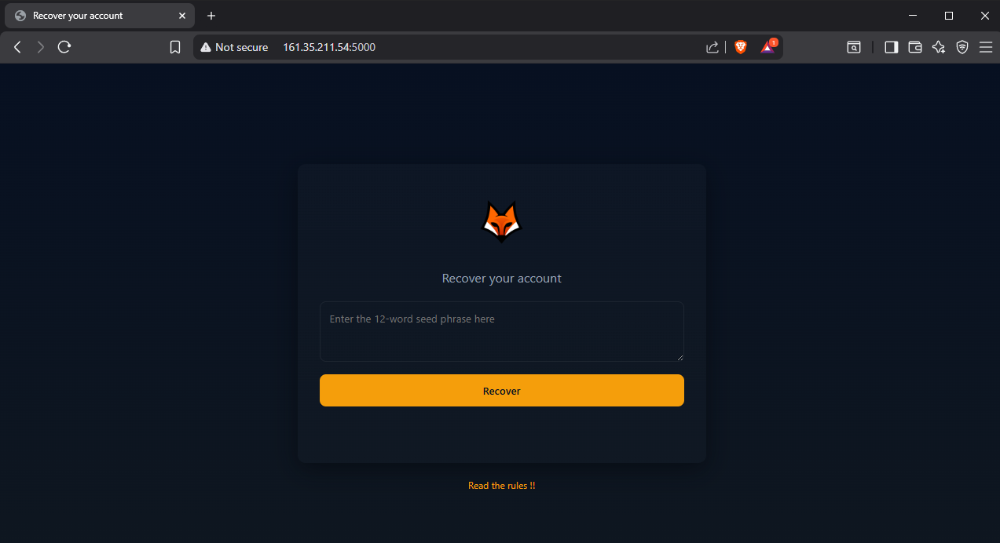

## Solution

Starting with the EML file, we can open it with a text editor or an email client.

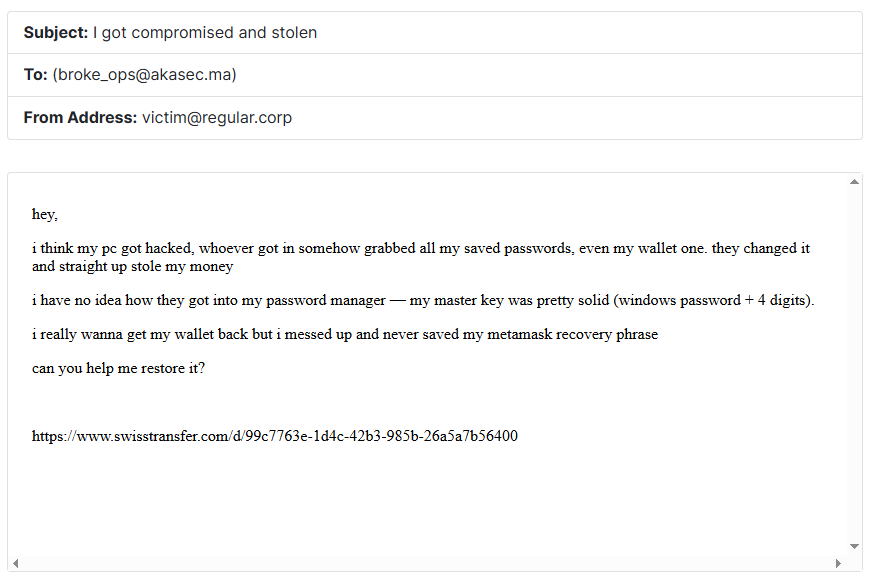

We have the following information:

- A Windows machine was hacked and the attacker obtained the Windows credentials
- The attacker also cracked the password manager database, where the password is the Windows password + 4 digits
- The database contains the MetaMask old password before the attacker changed it

Let's download the machine AD1 file and investigate it for the password manager database.

We find a KeePass database file named `db.kdbx` in the `C:\Users\hlmkh\Documents\` directory.

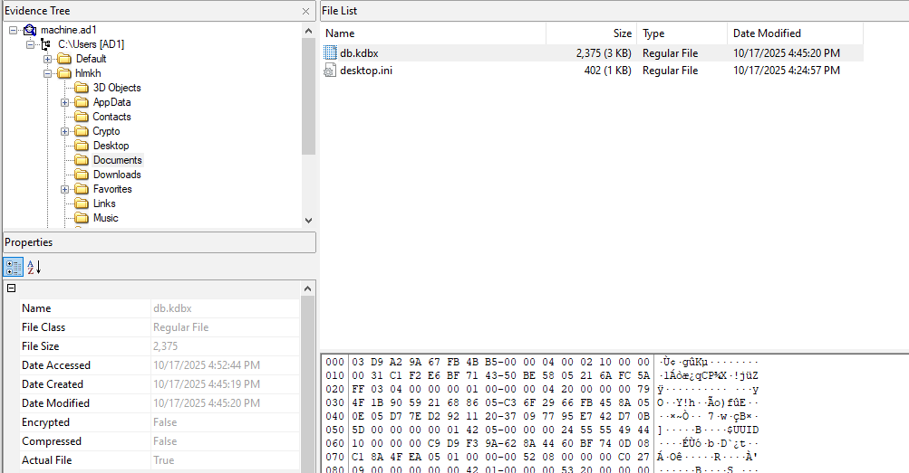

We need to extract the file to crack it, but first we need the Windows password.

To obtain that, we need the SAM and SYSTEM hive files from the machine.

These can normally be found in the `C:\Windows\System32\config\` directory, but in this machine they are located in `C:\`.

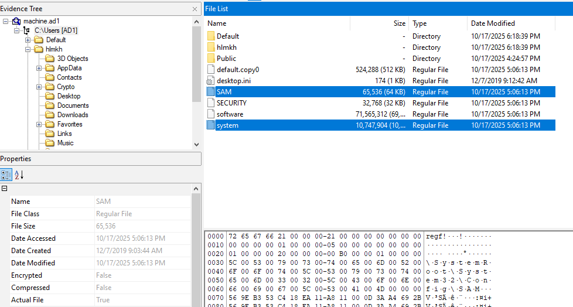

Let's extract them and use `mimikatz` to get the NTLM hash of the user `hlmkh`:

```bash
mimikatz # lsadump::sam /system:system /SAM:SAM
```

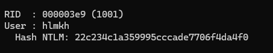

```
Hash NTLM : 22c234c1a359995cccade7706f4da4f0
```

You can use `hashcat` or `john the ripper` to crack the hash with the `rockyou.txt` wordlist, or you can use `crackstation.net` to crack it online.

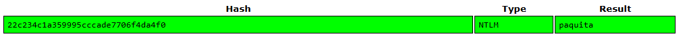

The password is `paquita`.

Now that we have the Windows password, we need to create a wordlist with the Windows password + 4-digit combinations.

Here's a simple Python script to generate the wordlist:

```python
prefix = "paquita"

with open("wordlist.txt", "w") as f:
    for n in range(10000):
        line = f"{prefix}{n:04d}\n"
        f.write(line)

print("done")
```

To crack the KeePass database, we can use `keepass2john` to convert it to a John the Ripper format and then use `john` to crack it.

However, in this case we can't because the database is using a version that is not supported by `keepass2john`.

So we need to use an alternative KeePass database cracker that supports this version.

I used the [brutalkeepass](https://github.com/toneillcodes/brutalkeepass/) tool to crack it.

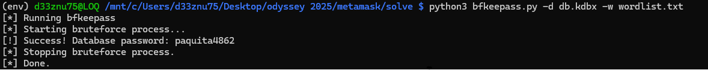

The password is `paquita4862`.

Opening the KeePass database, we find saved credentials for the MetaMask wallet.

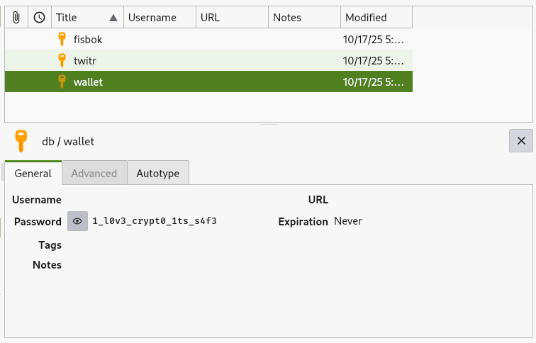

Password: `1_l0v3_crypt0_1ts_s4f3`

Now we need to recover the 12-word seed phrase from the machine.

MetaMask is a browser extension that serves as a cryptocurrency wallet and gateway to blockchain applications. It stores sensitive data, including seed phrases, in the browser's local storage or extension data.

It saves the vault data in the browser's local extension settings folder, which is located differently based on the browser used.

On this Windows machine, the only available browser is `Microsoft Edge`.

So we can look for the MetaMask vault data in the Edge extensions folder, which is located at:
`C:\Users\hlmkh\AppData\Local\Microsoft\Edge\User Data\Default\Local Extension Settings\`

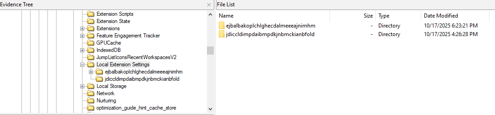

We can see two folders there; the first one is the MetaMask extension folder.

Inside the folder, we find a file named `001098.log`. The `.log` file in the MetaMask folder contains the vault data encrypted with the MetaMask password.

We can upload it to the [MetaMask Vault Decryptor](https://metamask.github.io/vault-decryptor/) website to decrypt it, or paste only the content of the vault JSON in the text area and input the MetaMask password we obtained from the KeePass database.

As a result, we get the decrypted vault data which contains the 12-word seed phrase.

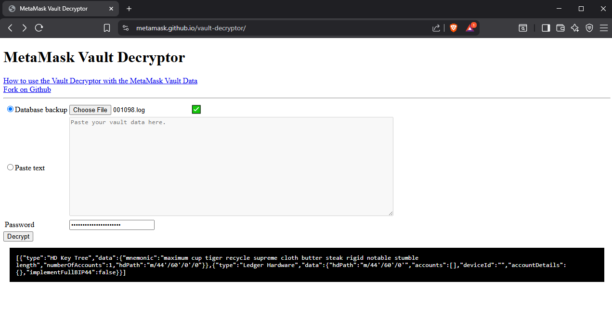

12-word seed phrase:
```
maximum cup tiger recycle supreme cloth butter steak rigid notable stumble length
```

Now we can use the seed phrase on the provided website to recover the wallet and retrieve the flag.

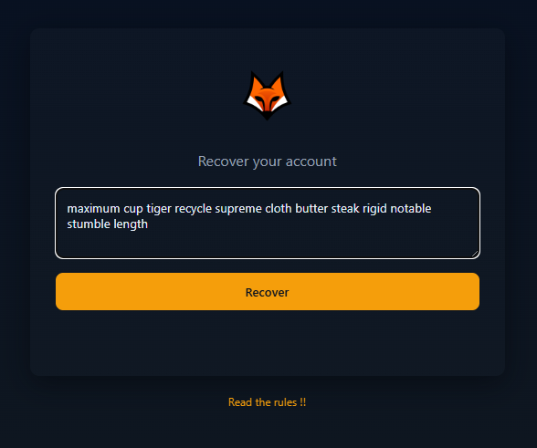

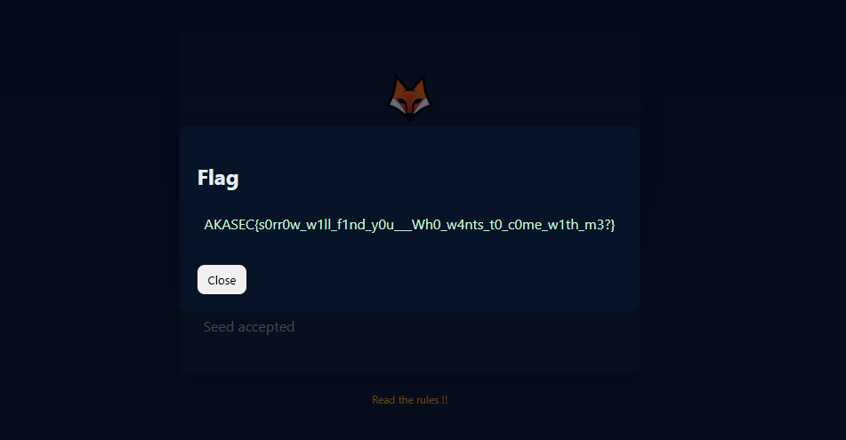

Flag: `AKASEC{s0rr0w_w1ll_f1nd_y0u___Wh0_w4nts_t0_c0me_w1th_m3?}`
