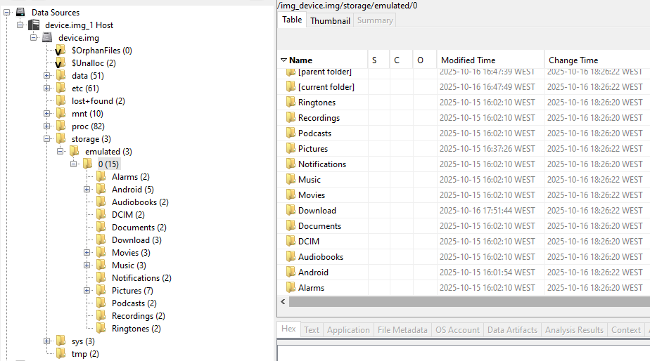
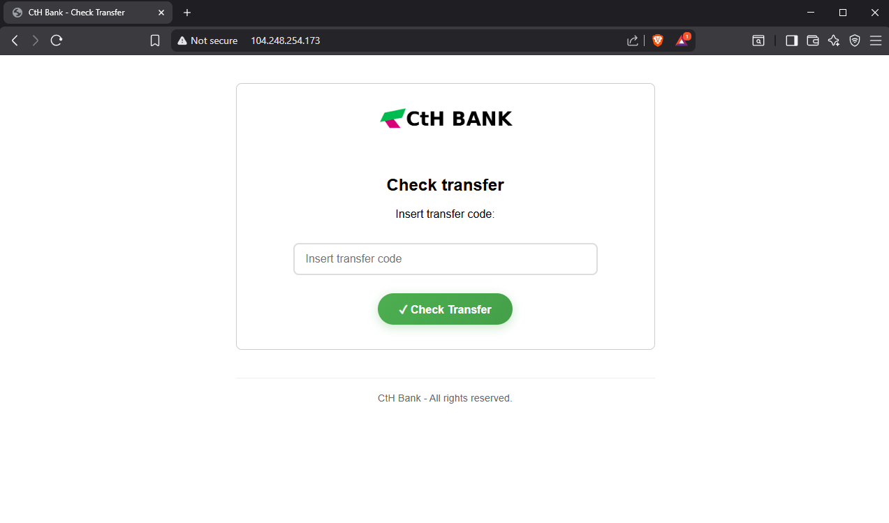
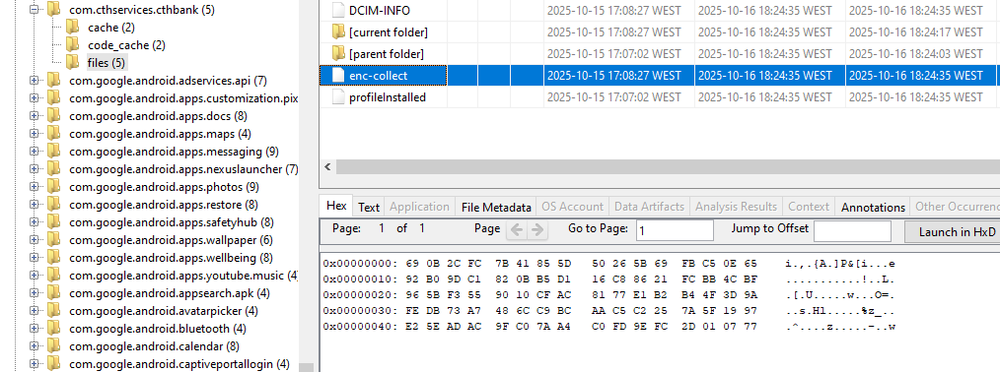
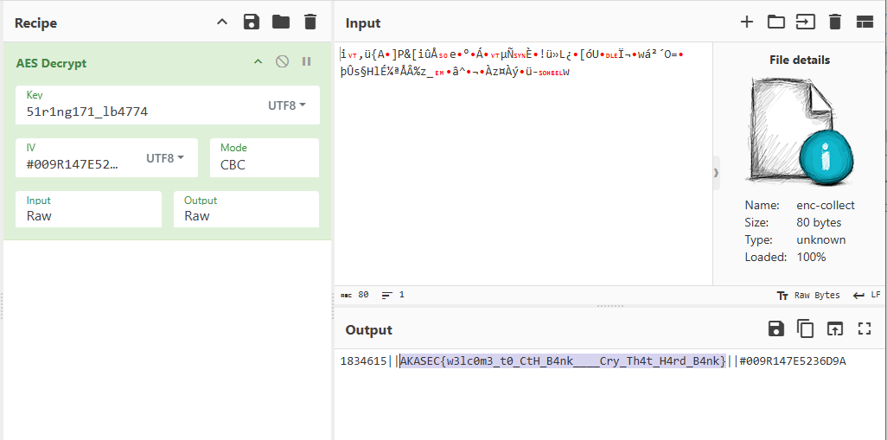

## Challenge Description


In this challenge, I gave participants an Android disk image. In this write-up, I will use Autopsy to analyze the image.



## Solution

The challenge description states that the device owner received a spoofed SMS that led to the theft of their bank account information. The goal is to analyze the Android disk image to find evidence of the spoofed SMS and any related activities on the device.

On Android, SMS messages are typically stored in a SQLite database located at `/data/data/com.android.providers.telephony/databases/mmssms.db`.

Let's navigate to that path in Autopsy and extract the `mmssms.db` file.

in the database, we can look at the `sms` table to find the messages.


We can see the last message is suspicious and related to our case:

```
From: CtH (+1760544288621)

Message:

Bank A withdrawal of 1000$ has been in your account, transfer code : EW36197 | For more information visit: https://bit.ly/check-ch
```

The website link is a shortened URL. When visiting it, we get redirected to a suspicious bank check page.



Let's input the transfer code `EW36197` on the page. The site confirms it found the transaction, providing us with a Transfer ID and a link to download the APK of the bank app.


Downloading and analyzing the APK, we find that it is a fake banking app designed to steal user credentials.

Our goal is to analyze the situation further. We can look for installed apps on the device to see if the fake banking app was installed.

We find that it is indeed installed on the device.

Its package name is `com.cthservices.cthbank` and its directory is located at `/data/app/com.cthservices.cthbank/`.


Now let's reverse engineer the APK to understand how it works and what data it might have stolen.

Using jadx to decompile the APK, we can explore its code.


We can find the suspicious activity in the `ReportActivity` class, which does the following:

- It collects user input: account number and password
- It encrypts the collected data with AES encryption in CBC mode:
    - The key is hardcoded in the code: `51r1ng171_lb4774`

    

    - The IV is the Transfer ID and it checks if it is 16 bytes long

    

- It saves the encrypted data to a file named `enc-collect` in the app's internal storage


- Then it sends the encrypted data along with device information to a remote server


Let's extract the encrypted data from the device image. We can find it in the app's internal storage at `/data/data/com.cthservices.cthbank/files/enc-collect`.



We have the AES key `51r1ng171_lb4774` and the IV is the Transfer ID `#009R147E5236D9A` that we obtained from the website (it is 16 bytes long).

Using a Python script or CyberChef, we can decrypt the file:



Flag: `AKASEC{w3lc0m3_t0_CtH_B4nk____Cry_Th4t_H4rd_B4nk}`